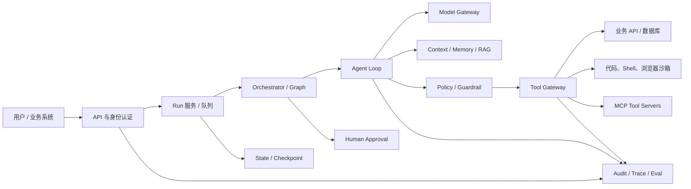
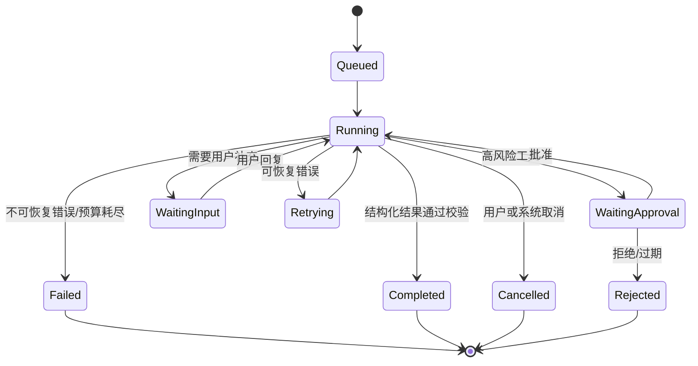

# Agent 开发调研报告

> 资料截点：2026-08-14  
> 适用对象：负责 Agent 平台、企业智能应用、编码 Agent、RAG Agent 或多 Agent 系统设计与落地的架构师、研发负责人和开发者。  
> 结论标识：`[官方已确认]` 表示来自项目官方文档、源码或规范；`[架构判断]` 表示基于多份材料归纳出的工程判断；`[待验证]` 表示需要结合目标业务、数据和生产流量验证。

## 0. 执行摘要

Agent 并不是“让大模型多调用几次工具”这么简单，而是一套包含模型适配、上下文组装、工具执行、状态持久化、权限控制、人工审批、观测评测和部署运行时的应用系统。框架的价值主要在于把这些通用能力抽象出来，但框架不会自动解决业务授权、工具副作用、数据合规和效果评测问题。

本报告的核心结论如下：

1. **先区分层次，再选框架。** LangChain 更像通用模型/工具/Agent 组件层；LangGraph 更像可持久化、可中断、可恢复的 Agent 工作流运行时；LlamaIndex 偏知识库和数据连接；Haystack 偏组件化检索与流水线；Semantic Kernel 偏企业插件和微软技术栈；CrewAI 偏角色化多 Agent；PydanticAI 偏 Python 类型安全和结构化输出；AutoGen 擅长事件驱动 Agent 与团队编排，但截至本报告截点，官方仓库已进入维护模式，新项目应同时评估 Microsoft Agent Framework。
2. **复杂业务优先使用“确定性工作流 + 局部 Agent”**。固定审批、数据写入、财务操作、生产变更等关键路径应由代码或图节点控制；把 LLM 的自由决策限制在检索、规划、工具选择、解释和候选方案生成等局部环节。
3. **三个指定项目不属于同一种产品形态。** Hermes Agent 是面向个人/团队的自托管通用 Agent 产品，特色是自学习技能、跨渠道 Gateway、记忆、定时任务和多种终端后端；OpenCode 是面向软件开发的完整编码 Agent，特色是权限系统、LSP、MCP、技能、插件、会话服务和多端 UI；`claude-code-sourcemap` 是对 Claude Code 发布包源映射的非官方还原，适合架构研究，不应被当作独立开源 Agent 框架或可直接商用产品。
4. **真正的生产门槛在运行时和治理。** 工具权限、沙箱、提示注入防护、租户隔离、幂等与补偿、checkpoint、人工审批、轨迹评测、成本控制和供应链治理，重要性不低于 Prompt 与模型选择。
5. **最小可行路线通常是单 Agent + 少量高质量工具。** 先建立可观测、可评测、可恢复的单 Agent 闭环；只有在工具数量、上下文长度、角色边界或并行性确实成为瓶颈时，再拆成 Manager/Worker、Handoff 或图式多 Agent。

### 0.1 推荐决策摘要

| 场景 | 优先考察方向 | 主要原因 | 第一阶段不建议做的事 |
| --- | --- | --- | --- |
| 企业知识库、根因分析、审批辅助 | LangGraph + 检索层，或 LlamaIndex/Haystack + 工作流运行时 | 可把检索、证据、分支、人工审批和恢复显式化 | 让 Agent 直接拥有全库读写权限 |
| Python 类型安全的业务 Agent | PydanticAI 或 LangChain/LangGraph | 结构化输出、依赖注入、测试和工具契约清晰 | 用自然语言结果替代业务 DTO 校验 |
| .NET/微软企业应用 | Semantic Kernel，并评估 Microsoft Agent Framework | 插件、DI、企业服务集成和微软生态匹配 | 继续投入 AutoGen 新特性而不评估迁移方向 |
| 角色化多 Agent 原型 | CrewAI 或 AutoGen AgentChat | 上手快，角色、任务和团队概念直观 | 一开始就设计十几个互相对话的 Agent |
| 编码 Agent | 参考 OpenCode 的工具、权限、LSP、MCP、技能和会话设计 | 软件工程需要代码读写、诊断、补丁、审批和可恢复会话 | 把 shell 和文件写入工具设为无条件允许 |
| 个人自托管、跨消息渠道助手 | 参考 Hermes Agent 的 Gateway、技能、记忆和 Cron | 产品化能力完整，适合长时间运行和多入口接入 | 把“自学习”直接接入系统提示或生产权限 |

## 1. 范围、术语与评估方法

### 1.1 四个容易混淆的概念

| 概念 | 含义 | 典型问题 |
| --- | --- | --- |
| Workflow（工作流） | 节点、分支和执行顺序大多由代码预先定义 | “下一步做什么”基本可预测 |
| Agent | LLM 在工具和约束范围内动态决定下一步 | “下一步是否调用工具、调用哪个工具”由模型参与决策 |
| Agent Framework（框架） | 提供模型适配、工具调用、状态、编排或观测的开发抽象 | 帮开发者少写基础设施，但也引入抽象和调试成本 |
| Agent Product/Runtime（产品/运行时） | 把 Agent、UI、权限、记忆、渠道、部署和运维打包成可使用系统 | 重点是完整用户体验和安全边界，不只是 SDK API |

Anthropic 对 Workflow 和 Agent 的区分是一个实用起点：Workflow 的路径由预先编写的代码决定，Agent 则由 LLM 动态决定过程和工具使用。工程上二者可以混合：外层是确定性工作流，局部节点使用 Agent。参考：[Building effective agents](https://www.anthropic.com/engineering/building-effective-agents)。

### 1.2 本报告的统一评估维度

所有框架和项目尽量按同一组维度比较：

1. 模型接入：供应商适配、流式输出、多模态、重试和路由。
2. Agent Loop：工具调用协议、循环退出、最大轮次、错误恢复和结构化输出。
3. 编排：顺序、并行、分支、循环、子 Agent、handoff 和人工介入。
4. 状态与记忆：短期会话、长期记忆、checkpoint、恢复、回放和数据删除。
5. 工具与协议：本地函数、代码执行、浏览器、MCP、A2A、插件和技能。
6. 安全与治理：身份、权限、沙箱、审批、审计、租户隔离和供应链。
7. 可观测性与评测：LLM/工具轨迹、成本、延迟、任务成功率和回归测试。
8. 产品化能力：CLI/UI/API、消息渠道、部署、队列、并发和运维。
9. 工程代价：学习曲线、抽象泄漏、生态依赖、版本风险和调试难度。

## 2. Agent 的核心运行模型

### 2.1 最小 Agent 闭环

一个可生产化的 Agent 至少应显式处理以下循环：

```text
用户请求
  -> 身份/租户/风险校验
  -> 上下文组装（系统规则、历史、检索证据、工具目录）
  -> 模型推理
       -> 最终答案/结构化结果 -> 输出校验 -> 返回
       -> 工具调用 -> 权限与风险策略 -> 工具执行 -> 工具结果清洗
                         -> 状态/checkpoint -> 下一轮模型推理
```

循环必须有明确退出条件：模型给出最终结果、工具错误达到重试上限、达到最大轮次/预算、触发人工审批、会话被取消或系统检测到安全风险。OpenAI 的 Agent 实践指南把工具分为 Data、Action、Orchestration 三类，并建议先用单 Agent 建立清晰的运行循环，再根据复杂度拆分 Agent。参考：[A practical guide to building agents](https://openai.com/business/guides-and-resources/a-practical-guide-to-building-ai-agents/)。

### 2.2 推荐的分层架构



各层边界建议如下：

- **Model Gateway**：隐藏供应商差异，统一模型、工具调用、流式事件、超时、重试、fallback 和 token 统计。
- **Agent Loop**：负责“思考—工具—结果—再思考”的最小闭环，不应直接拥有业务数据库连接。
- **Orchestrator/Graph**：控制确定性节点、分支、并行、循环、人工审批和恢复点。
- **Context/Memory/RAG**：区分事实证据、会话历史、用户偏好和系统规则，保留来源与时间范围。
- **Policy/Guardrail**：在模型生成工具调用之后、实际执行之前再次做权限和风险判定；不能只依赖 Prompt。
- **Tool Gateway**：统一工具 schema、授权、超时、幂等、审计、版本和错误格式。
- **State/Checkpoint**：保存可恢复的业务状态、模型消息、工具结果引用和审批状态；敏感数据按策略加密或脱敏。
- **Audit/Trace/Eval**：让一次运行可以解释、复现、评测和追责。

### 2.3 Agent Loop 的伪代码

```text
run(request, identity, thread_id):
    state = load_or_create_state(thread_id)
    authorize_request(identity, request)

    for turn in range(MAX_TURNS):
        context = build_context(state, identity)
        decision = model.generate(context, tool_schemas=allowed_tools(identity, state))
        record_model_trace(decision)

        if decision.is_final:
            result = validate_output(decision.output)
            record_audit("completed", result)
            return result

        call = validate_tool_call(decision.tool_call)
        policy = evaluate_tool_risk(call, identity, state)
        if policy.requires_human_approval:
            save_checkpoint(state, status="waiting_approval")
            return ApprovalRequired(call)
        if not policy.allowed:
            append_tool_denial(state, policy.reason)
            continue

        tool_result = execute_idempotently(call, state)
        safe_result = sanitize_tool_output(tool_result)
        state = append_step(state, call, safe_result)
        save_checkpoint(state)

    return Failed("max turns exceeded")
```

这里的关键不是伪代码本身，而是三个边界：

1. 模型输出必须经过 schema 和策略校验，不能直接执行。
2. 工具执行必须能被审计、超时、取消、重试和幂等化。
3. 每个可能产生外部副作用的节点都要有恢复和人工介入方案。

## 3. 主流开源 Agent 框架

### 3.1 总览

| 框架 | 主要定位 | 核心能力 | 给开发者带来的便利 | 主要代价/边界 |
| --- | --- | --- | --- | --- |
| AutoGen | 事件驱动 Agent 与团队编排 | Core runtime、AgentChat、Extensions、Teams、Studio、Bench | 快速搭建多 Agent 对话、团队和模型/工具扩展 | 官方仓库截至截点为维护模式；复杂对话容易难以控制和调试 |
| LangChain | 通用 LLM/Agent 组件与高层 Agent harness | 模型、工具、Prompt、结构化输出、中间件、`create_agent`、生态集成 | 组件丰富、供应商切换快、工具和中间件复用方便 | 抽象层多；复杂流程需要进一步下沉到 LangGraph |
| LangGraph | 有状态 Agent 工作流运行时 | State、Node、Edge、条件分支、循环、checkpoint、interrupt、恢复 | 可以把流程、状态和人工审批显式化，适合长任务 | 编程模型更底层，需要自行设计状态和业务约束 |
| LlamaIndex | 数据与知识库驱动的 Agent | Reader、Index、Retriever、Query Engine、Tools、AgentWorkflow、Memory | 连接企业数据、把检索能力封装为工具较快 | 通用编排和复杂治理仍需补充运行时 |
| Haystack | 组件化 RAG/搜索/流水线 | Components、Pipelines、Document Store、Agent、工具循环 | 检索、排序、文档处理和确定性流水线边界清晰 | 多 Agent 产品能力不如专门的团队编排框架丰富 |
| Semantic Kernel | 微软生态的 Kernel/Plugin/Agent | Kernel、DI、Plugins、Function Calling、Agent、Orchestration | 企业服务、OpenAPI、.NET 与 Azure 集成自然 | 跨语言能力和版本演进需要持续评估 |
| CrewAI | 角色化多 Agent 与 Flow | Agent、Task、Crew、Process、Flow、Memory、Guardrail、Checkpoint | 角色、任务和团队表达直观，原型开发快 | 角色对话不等于业务正确性；复杂状态需转为显式 Flow |
| PydanticAI | Python 类型安全 Agent | Pydantic 输出、依赖注入、工具 schema、测试、HITL、图和持久化能力 | DTO、工具入参和结果校验清晰，适合后端工程 | 更偏 Python 工程组件，平台化能力需自行组装 |

> 选型提醒：这里的“主流”按开发者使用和生态影响力综合判断，不代表每个项目都适合生产，也不等于当前活跃度、社区规模或企业支持完全相同。

### 3.2 AutoGen

#### 定位与核心功能

AutoGen 的官方架构分为多个层次：

- **Core API**：事件驱动的 Agent、消息传递和运行时，支持本地及实验性分布式模式。
- **AgentChat API**：面向常见场景的高层 API，提供两 Agent 对话和团队抽象。
- **Extensions API**：模型客户端、代码执行器以及其他可替换扩展。
- **Teams**：`RoundRobinGroupChat`、`SelectorGroupChat`、`Swarm`、`MagenticOneGroupChat` 等团队模式。
- **AutoGen Studio**：面向研究和原型的低代码 UI；官方明确提醒它不是生产部署方案。
- **AutoGen Bench/Magentic-One**：评测和复杂任务研究方向的配套能力。

官方资料：

- [AutoGen GitHub README](https://github.com/microsoft/autogen/blob/main/README.md)
- [AutoGen Teams 文档](https://microsoft.github.io/autogen/stable/user-guide/agentchat-user-guide/tutorial/teams.html)
- [AutoGen Studio README](https://github.com/microsoft/autogen/blob/main/python/packages/autogen-studio/README.md)

#### 给开发者的便利

1. **把多 Agent 对话变成可配置团队。** 开发者可以把角色、消息、终止条件和团队策略组合起来，不必从零实现消息路由。
2. **底层和高层兼顾。** 简单需求使用 AgentChat，复杂需求可以下沉到 Core 的事件和运行时。
3. **扩展点相对明确。** 模型客户端、工具、代码执行和运行时可以替换，适合研究型迭代。
4. **便于比较协作策略。** 轮询、选择器、Swarm 和 Magentic-One 等模式为多 Agent 实验提供了统一试验面。

#### 工程边界与当前状态

截至本报告截点，官方仓库 README 将 AutoGen 标注为 **maintenance mode**：社区可以继续维护和修复，但不再添加新特性，并建议新用户从 Microsoft Agent Framework 开始。Microsoft 的迁移指南说明，Agent Framework 试图把 AutoGen 的 Agent/Team 能力与 Semantic Kernel 的企业能力合并，并增加类型化图式 Workflow。

- [AutoGen 当前状态与迁移提示](https://github.com/microsoft/autogen/blob/main/README.md)
- [从 AutoGen 迁移到 Microsoft Agent Framework](https://learn.microsoft.com/en-us/agent-framework/migration-guide/from-autogen/)
- [Microsoft Agent Framework](https://github.com/microsoft/agent-framework)

因此，AutoGen 仍适合：

- 维护已有 AutoGen 项目；
- 研究多 Agent 对话、团队策略和事件驱动架构；
- 在已经验证依赖和运维方式的内部原型中使用。

不建议把 AutoGen 作为新生产平台的唯一长期押注，除非团队已经完成版本、维护和迁移风险评估。

### 3.3 LangChain

LangChain 的核心价值是把模型、工具、Prompt、结构化输出、中间件和 Agent harness 统一到一套开发接口中。当前文档中的 `create_agent` 是一个可配置的高层 Agent 实现，底层构建于 LangGraph；LangGraph 负责更底层的流程控制和持久化。

官方资料：[LangChain Python Overview](https://docs.langchain.com/oss/python/langchain/overview)、[Agents](https://docs.langchain.com/oss/python/langchain/agents)。

#### 核心能力

- **统一模型接口**：在不同供应商之间切换，减少上层业务对某家 SDK 的耦合。
- **工具抽象**：把函数、API、检索器或业务能力声明成有名称、描述和参数 schema 的 Tool。
- **Agent loop**：模型决定是否调用工具，工具返回结果后继续循环，直到得到最终答案或触发停止条件。
- **结构化输出**：使用 `response_format` 等能力约束最终结果，适合映射到业务 DTO。
- **Middleware**：在模型调用前后插入上下文管理、动态 Prompt、规划、委派、guardrail、重试和日志逻辑。
- **State/Memory 接入**：通过 checkpointer、thread id 和 Agent state 保存会话或运行状态。
- **生态集成**：模型、向量库、检索器、工具、数据源、观测和评测的连接器较多。

#### 对开发者的便利

1. **减少供应商适配代码。** 模型与工具接口统一，迁移模型和替换部分组件的成本较低。
2. **从简单到复杂逐步下沉。** 先用 `create_agent`，遇到复杂状态和分支再转向 LangGraph，而不是一开始就编写完整运行时。
3. **中间件适合横切治理。** 可以把 token 预算、动态上下文、敏感信息过滤、审批和观测放到统一入口。
4. **RAG 和工具组合成熟。** 检索器、文档处理、工具调用和结构化回答可以组合成一条可观测链路。

#### 边界

LangChain 的生态很大，但抽象也多。常见风险是：

- 只依赖高层 Agent，无法解释复杂循环、重试和状态变化；
- 把“链能运行”误当成“业务流程可恢复”；
- 组件默认行为、版本差异和消息格式变化影响调试；
- 将数据库、搜索、shell 等高风险能力直接包装成 Tool，却没有独立的策略层。

建议把 LangChain 当作组件层和高层入口，把业务关键路径、状态机和恢复语义放到显式的 LangGraph 或自有 Orchestrator 中。

### 3.4 LangGraph

LangGraph 是一个面向长时间运行、有状态 Agent 的低层编排和运行时。它的基本模型是：

- **State**：整个运行共享的数据结构；
- **Node**：读取 State 并返回状态更新的函数；
- **Edge**：连接节点，决定下一步；
- **Conditional Edge**：根据状态或模型结果进行分支；
- **Checkpointer/Thread**：保存每一步状态，支持恢复、回放和多轮会话；
- **Interrupt**：暂停流程等待人工输入或审批，再通过同一线程恢复。

官方资料：[LangGraph Overview](https://docs.langchain.com/oss/python/langgraph/overview)、[Graph API](https://docs.langchain.com/oss/python/langgraph/graph-api)、[Persistence](https://docs.langchain.com/oss/python/langgraph/persistence)、[Interrupts](https://docs.langchain.com/oss/python/langgraph/interrupts)。

#### 解决的核心问题

1. **确定性与智能决策混合。** 代码节点可以处理校验、数据库写入、审批和固定分支；LLM 节点只负责需要语言理解或规划的部分。
2. **长任务可恢复。** 每一步有 checkpoint，进程崩溃或人工暂停后可以从线程状态继续。
3. **人工介入是运行时语义。** `interrupt()` 可以在高风险工具前暂停，而不是把“请人工确认”写进 Prompt 后希望模型自觉执行。
4. **循环和分支可审查。** 图结构比隐式的 Agent loop 更容易画图、测试和做状态覆盖分析。
5. **支持回放与时间旅行。** 在合适的 checkpoint 配置下，可以重放、分叉状态，用于调试和评测。

#### 关键注意事项

- 中断恢复时，包含中断点的节点可能从节点开始处重新执行；因此中断前的外部副作用必须幂等，或把副作用放在审批之后。
- Checkpoint 只保存状态，不会自动让数据库写入、消息发送或支付操作具备事务语义。
- 图越复杂，状态 schema、版本迁移、并发冲突和回放兼容性越需要专门治理。

#### 适用判断

如果需求包括长时间任务、人工审批、失败恢复、并行分支、明确的状态机或审计要求，LangGraph 通常比纯高层 Agent API 更合适。如果只是一次问答、少量只读工具或简单 RAG，直接使用 LangChain 的高层 Agent 或更轻量实现更经济。

### 3.5 LlamaIndex

LlamaIndex 的突出定位是“让 Agent 能使用企业数据”。它把 Reader、Index、Retriever、Query Engine、数据连接器和工具封装在同一个生态中，再向上提供 `FunctionAgent`、`ReActAgent`、`CodeActAgent` 和 `AgentWorkflow` 等 Agent 形态。

官方资料：[Agent 概念](https://developers.llamaindex.ai/python/framework/understanding/agent/)、[Deploying Agents](https://developers.llamaindex.ai/python/framework/module_guides/deploying/agents/)。

核心便利包括：

- 可以把 Python 函数、Query Engine、外部 API 或 Tool Spec 注册为 Agent 工具；
- 把“检索—生成—引用”能力直接转成 Agent 可调用的知识工具；
- `AgentWorkflow` 支持多 Agent handoff、工具调用和共享状态；
- 提供记忆组件，降低多轮对话的接入成本；
- 需要更强控制时，可以手动实现 Agent loop，而不是被固定流程限制。

主要边界：

- 数据接入方便不代表检索结果有权限隔离，ACL 仍需业务侧保证；
- Query Engine 被包装为工具后，仍要控制查询范围、成本和结果长度；
- 多 Agent、审批、复杂恢复和供应链安全需要与其他运行时组合。

### 3.6 Haystack

Haystack 是组件化的搜索、RAG 和 Agent 框架。它以 Components、Pipelines 和 Document Stores 为基础，Agent 则是一个根据工具调用结果不断迭代的 LLM 循环，并通过 `exit_conditions` 控制何时结束。

官方资料：[Haystack Agent](https://docs.haystack.deepset.ai/docs/agent)、[Haystack 文档](https://docs.haystack.deepset.ai/)。

它适合以下工作：

- 将文档读取、切分、Embedding、向量检索、BM25、融合、重排和生成组成显式流水线；
- 对每个组件做输入输出和性能观测；
- 把检索、问答、工具调用和退出条件组合成相对清晰的 Agent；
- 在需要确定性数据流的场景中，避免所有逻辑都放在 Prompt 里。

和 LangGraph 相比，Haystack 更强调数据与组件流水线；如果需要复杂的跨节点持久化、人工审批和长任务恢复，通常需要补充外部运行时或结合图式编排。

### 3.7 Semantic Kernel

Semantic Kernel 的中心抽象是 Kernel：它集中管理模型服务、插件、函数和中间件。插件可以封装本地代码、REST/OpenAPI 或其他业务 API，再通过 function calling 暴露给 Agent。其 Agent 相关文档覆盖模型、工具、人类输入、Agent 协作和编排。

官方资料：[Agent Framework](https://learn.microsoft.com/en-us/semantic-kernel/frameworks/agent/)、[Kernel](https://learn.microsoft.com/en-us/semantic-kernel/concepts/kernel)、[Plugins](https://learn.microsoft.com/en-us/semantic-kernel/concepts/plugins/)。

开发便利：

- 与 .NET 依赖注入、配置、日志、服务注册和企业应用结构匹配；
- 插件契约适合把已有企业服务逐个接入；
- function calling、OpenAPI 导入和中间件可作为统一扩展面；
- 适合把 Agent 当作现有企业应用中的一个能力，而不是独立脚本。

边界：插件定义清晰并不等于权限安全；同一个 Plugin 可能被多个 Agent 或租户使用，必须在调用层注入身份、数据范围和风险策略。

### 3.8 CrewAI

CrewAI 用三个概念表达多 Agent 系统：

- **Agent**：角色、目标、背景、模型和工具；
- **Task**：输入、预期输出、负责 Agent 和上下文；
- **Crew**：Agent 与 Task 的组合，以及 sequential/hierarchical 等 Process；
- **Flow**：更显式的事件、状态、路由、持久化和恢复编排。

官方资料：[CrewAI 文档](https://docs.crewai.com/index)、[Agents](https://docs.crewai.com/v1.15.16/en/concepts/agents)、[Crews](https://docs.crewai.com/v1.15.16/en/concepts/crews)、[Flows](https://docs.crewai.com/v1.15.16/en/concepts/flows)、[Memory](https://docs.crewai.com/v1.15.16/en/concepts/memory)。

它为原型开发带来的便利：

- 角色和任务表达符合业务人员直觉；
- 顺序、层级、委派和上下文传递的样板代码少；
- Flow 可以承载 Pydantic 状态、路由、并行起点、持久化、恢复和人工反馈；
- 内置记忆、知识、guardrail、结构化输出和 token 使用统计等产品化入口。

主要风险：

- “多个角色互相聊天”不等于更高准确率，可能只是增加 token、延迟和错误传播；
- 对高风险业务，Crew 应被放在明确的 Flow 和策略层中；
- 文档中已有对内置代码执行方式逐步弃用、推荐使用专用沙箱服务的提示，不能把 Agent 进程本身当作安全执行环境。

### 3.9 PydanticAI

PydanticAI 的定位是面向 Python 应用的类型安全 Agent 框架，强调模型无关、Pydantic 结构化结果、依赖注入和可测试性。官方能力列表还包括工具、MCP、HITL、持久化/耐久执行、图式工作流、流式输出、评测和 OpenTelemetry/Logfire 可观测性。

官方资料：[PydanticAI Overview](https://pydantic.dev/docs/ai/overview/)。

它特别适合：

- 后端 API 需要严格 DTO，而不是自由文本；
- 工具依赖数据库、用户身份、配置或外部服务，需要显式依赖注入；
- 希望使用离线测试模型验证工具选择、参数和结构化输出；
- 需要把 Agent 作为普通 Python 业务代码管理，而不是大型 DSL。

边界是平台能力需要自行拼装：队列、统一权限、沙箱、租户隔离、跨 Agent 编排和生产级运行控制不能只靠类型系统解决。

### 3.10 框架选择决策树

```text
是否主要围绕企业数据、索引和检索？
  是 -> 优先 LlamaIndex / Haystack，再配 LangGraph 或自有工作流运行时
  否
是否需要长任务、审批、恢复、复杂分支和可回放？
  是 -> LangGraph / Microsoft Agent Framework / 自有状态机
  否
是否是角色化多 Agent 原型？
  是 -> CrewAI / AutoGen AgentChat，并尽早收敛为显式 Flow
  否
是否需要严格 Python 类型契约？
  是 -> PydanticAI，或 LangChain + Pydantic schema
  否
是否深度使用 .NET/微软企业技术栈？
  是 -> Semantic Kernel / Microsoft Agent Framework
  否 -> LangChain 高层 Agent 或轻量自建 Agent Loop
```

最终选型不要只比较“能否调用工具”，还要验证以下问题：一次任务失败后能否恢复、工具越权能否被阻断、外部副作用能否幂等、运行轨迹能否重放、生产版本能否回归评测。

## 4. 三个开源 Agent 实现对比

### 4.1 先说明可比边界

这三个项目不能简单视为三个同类 Agent 框架：

| 项目 | 实际类型 | 主要用户 | 可否作为独立产品基础 |
| --- | --- | --- | --- |
| [Hermes Agent](https://github.com/nousresearch/hermes-agent) | 自托管通用 Agent 产品/运行时 | 个人开发者、研究者、团队 | 可以，但需要补业务授权、租户和生产治理 |
| [OpenCode](https://github.com/anomalyco/opencode) | 开源编码 Agent 产品及其服务/SDK | 软件开发者、团队和 IDE/CLI 用户 | 可以借鉴或二次开发编码 Agent，但要遵守其项目许可与依赖边界 |
| [claude-code-sourcemap](https://github.com/ChinaSiro/claude-code-sourcemap) | 对发布包 source map 的非官方源码还原 | 研究 Claude Code 内部设计的开发者 | 不应当直接作为商用产品或独立框架使用 |

因此，后续比较分成两层：

1. 比较 Hermes 与 OpenCode 的可运行产品架构；
2. 把 `claude-code-sourcemap` 作为“研究材料”单独分析它暴露出的成熟编码 Agent 设计线索，并标出证据和使用边界。

### 4.2 Hermes Agent：自托管、跨渠道、自改进的通用 Agent

#### 项目定位

Hermes Agent 的官方 README 将其定位为 Nous Research 构建的自托管 Agent，强调本地控制、自学习技能、记忆、长期会话和多渠道接入。它不是只有一个命令行循环，而是将 Agent、Gateway、技能、记忆、调度和终端执行后端整合成一个可长期运行的产品。

主要资料：

- [Hermes Agent README](https://github.com/NousResearch/hermes-agent/blob/main/README.md)
- [Hermes Architecture](https://github.com/NousResearch/hermes-agent/blob/main/website/docs/developer-guide/architecture.md)
- [Hermes Contributing/Security 相关说明](https://github.com/NousResearch/hermes-agent/blob/main/CONTRIBUTING.md)
- [Hermes 官方文档](https://hermes-agent.nousresearch.com/docs/)

#### 架构特色

| 维度 | Hermes 的实现/设计特点 | 工程价值 |
| --- | --- | --- |
| 入口 | CLI、Gateway、ACP、Batch Runner、API Server、Python Library | 同一 Agent 核心可以服务交互式、消息渠道、批处理和程序化调用 |
| 核心循环 | `AIAgent` 负责 Prompt 构建、Provider 选择、工具分发、重试/fallback、上下文压缩、回调和持久化 | 将 Agent loop 与外部渠道解耦，便于复用 |
| 模型 | 支持多种 Provider 和不同 API 形态，包括 Chat Completions、Codex Responses、Anthropic 方式 | 适合自托管、混合模型和供应商切换 |
| 工具 | 官方架构文档描述了 70+ 工具、28 个工具集；覆盖终端、浏览器、Web、MCP 等 | 通用任务能力面广，减少重复接入 |
| 终端执行 | Local、Docker、SSH、Singularity、Modal、Daytona、Vercel Sandbox 等后端 | 把“在哪里执行”从 Agent 决策中抽离，便于按风险选沙箱 |
| 记忆 | SQLite + FTS5 会话存储、会话搜索、记忆插件和用户模型 | 支持长期使用、检索历史和个性化 |
| 自改进 | 将技能创建/改进、技能文件和记忆 nudges 纳入工作流 | 能把重复经验沉淀为可复用能力，但必须经过权限和审核 |
| 渠道 | Telegram、Discord、Slack、WhatsApp、Signal 等 Gateway | 适合个人助手和团队消息入口 |
| 调度 | Cron 与定时任务 | 支持主动式 Agent，而不是只响应在线请求 |
| 并行/子 Agent | 支持子 Agent 和并行任务，适合批处理和研究任务 | 提升吞吐，但会放大成本、并发和权限风险 |
| 扩展 | Skills、MCP、插件 hooks、独立记忆 Provider | 对研究和个人定制较友好 |

#### 特色价值

1. **产品化广度高。** CLI、消息渠道、API、批处理、Cron、技能和记忆都属于真实使用入口，体现了 Agent 从 Demo 到长期运行产品需要补齐的周边能力。
2. **执行后端可替换。** 终端执行不是固定绑定本机 shell，而是通过多种 backend 支持不同隔离强度和部署环境。
3. **技能是可积累的能力单元。** 复杂任务不一定每次都从零 Prompt，Agent 可以把稳定流程沉淀为技能文件，再按需加载。
4. **对上下文压力有明确工程处理。** 会话搜索、压缩、缓存和记忆组件共同控制长会话的 token 成本。

#### 需要谨慎的地方

- “自学习”不能直接等于“自动修改生产权限”。技能、记忆和用户模型写入必须有来源、作用域、版本、审核、回滚和删除机制。
- 多渠道入口带来身份映射、群聊越权、消息伪造、敏感信息回传和 webhook 安全问题。
- 终端后端提供了执行隔离选项，但具体安全性取决于容器权限、网络出口、挂载目录、凭据注入和资源配额，不能只看 backend 名称。
- 多 Provider fallback 可能导致数据跨境、模型能力差异、工具调用格式变化和成本不可控，需要在路由策略中显式声明。

#### 适合借鉴的设计

- 把 Agent 核心、渠道 Gateway、运行时、技能、记忆和调度分层；
- 用统一的工具注册表和执行后端抽象支持本地/远程/沙箱；
- 把会话存储、上下文压缩、检索和用户模型作为独立能力；
- 通过 hooks 做工具前后、模型前后和会话事件的统一治理。

### 4.3 OpenCode：面向软件工程的完整编码 Agent

#### 项目定位

OpenCode 的官方资料将其定位为开源 AI coding agent，提供终端 UI、桌面端、IDE 扩展、服务端和 SDK 相关能力。它把编码 Agent 需要的文件读写、Shell、搜索、LSP、MCP、技能、插件、权限、会话、压缩和多 Agent 入口组合在一起。

主要资料：

- [OpenCode README](https://github.com/anomalyco/opencode/blob/dev/README.md)
- [OpenCode 官方文档](https://opencode.ai/docs/)
- [Tools](https://opencode.ai/docs/tools/)
- [Agents](https://opencode.ai/docs/agents/)
- [MCP Servers](https://opencode.ai/docs/mcp-servers/)
- [LSP](https://opencode.ai/docs/lsp/)
- [Plugins](https://opencode.ai/docs/plugins/)
- [Skills](https://opencode.ai/docs/skills/)
- [Server](https://opencode.ai/docs/server/)

#### 架构特色

| 维度 | OpenCode 的实现/设计特点 | 工程价值 |
| --- | --- | --- |
| Agent 角色 | `build` 具有完整开发权限；`plan` 默认只读并在执行 Bash 前询问；另有通用子 Agent，可通过 `@` 调用 | 用角色和权限预设降低“规划阶段误改代码”的风险 |
| 工具 | read、write、edit、bash、grep、glob、LSP、apply_patch、skill、web、question、todo 等 | 覆盖从定位、修改、诊断到交互确认的编码闭环 |
| 权限 | 内置、Custom、MCP 工具均可按 allow/deny/ask 和通配规则控制；写入能力受 edit 权限控制 | 将“能否执行”从 Prompt 中抽成运行时策略 |
| 代码理解 | 原生接入 LSP，获取 diagnostics 等语言服务反馈 | 让 Agent 在编译器/语言服务反馈下迭代，而非只依赖文本搜索 |
| 外部能力 | 本地和远程 MCP；技能按需加载；插件支持 hooks 和自定义行为 | 形成可扩展的工具、知识和流程生态 |
| 会话 | Session、消息 Part、工具结果、子任务、压缩、问题/权限请求等均被建模 | 支持长会话、交互审批和 UI 展示 |
| 核心实现 | `packages/core`、`opencode`、`server`、`tui`、`desktop`、`sdk` 等包分层；工具有输入/输出 schema、执行上下文和权限声明 | 适合演进为多端产品和 API 服务 |
| 服务化 | `opencode serve` 提供 headless HTTP 服务和 OpenAPI 入口 | 可被 IDE、自动化平台或远程客户端调用 |
| 模型适配 | Provider、Agent、Plugin、ToolRegistry、MCP、LSP、structured output 和 compaction 在 Session Prompt 中汇合 | 让一次 Agent run 的依赖更完整可控 |

#### 特色价值

1. **把编码 Agent 的真实工具链作为一等公民。** 文件、搜索、补丁、Shell、LSP、TODO 和问题询问共同形成“定位—修改—验证”的闭环。
2. **权限模型较贴近真实开发风险。** `allow/deny/ask` 比单一的“是否启用工具”更适合区分只读、可逆修改和高风险执行。
3. **计划与执行分离。** 只读 Plan Agent 与具备写权限的 Build Agent 是一个简单但有效的风险分层。
4. **协议和扩展面完整。** MCP、技能、插件、LSP、Server、SDK 和多端 UI 的组合，显示出编码 Agent 需要从单进程脚本演进为平台。
5. **Session 是产品核心。** 工具结果、推理、子任务、压缩、权限和人工问题需要在 UI、服务和恢复之间保持一致，OpenCode 的会话建模对此有较强参考价值。

#### 需要谨慎的地方

- LSP diagnostics 只能说明语言服务发现了问题，不能替代测试、构建、运行和业务验收。
- MCP 工具数量增加会扩大上下文和攻击面；文档也提醒工具描述可能使上下文变大，因此应按项目、用户和任务动态加载。
- `bash`、写文件、网络、插件和远程 MCP 组合后，权限规则、凭据范围和网络出口必须统一管理。
- coding Agent 的“验证成功”不能只看模型说“完成”，必须运行项目自己的测试、lint、build 或预定义验收命令。
- OpenCode 的开发分支和依赖变化较快，二次开发需要锁定版本、维护兼容性和审查许可证。

#### 适合借鉴的设计

- 内置工具、MCP、技能、插件和 LSP 的统一注册/调用面；
- `allow/deny/ask`、角色权限和项目级配置；
- Session/Part/Permission/Question/Compaction 等运行状态模型；
- 将 CLI、TUI、桌面、IDE、Server 和 SDK 复用同一个 Agent 核心；
- 代码修改后必须将测试、编译器和 LSP 反馈放回 Agent loop。

### 4.4 `claude-code-sourcemap`：源码还原型研究材料

#### 项目边界

`claude-code-sourcemap` 的 README 明确说明：它是根据公开 npm 包及其 source map 还原出的研究性代码，不是 Anthropic 原始开发仓库，也不代表原始内部工程结构。README 描述的快照对应 `@anthropic-ai/claude-code` 2.1.88，包含大量从 `cli.js.map` 提取的 `sourcesContent`。

主要资料：

- [项目 README](https://github.com/ChinaSiro/claude-code-sourcemap)
- [还原后的 `query.ts`](https://github.com/ChinaSiro/claude-code-sourcemap/blob/main/restored-src/src/query.ts)
- [还原后的 Agent Prompt](https://github.com/ChinaSiro/claude-code-sourcemap/blob/main/restored-src/src/tools/AgentTool/prompt.ts)

README 还声明源码权利归 Anthropic，项目用于研究，不应直接用于商业用途。这里不做法律结论，但**任何复制代码、打包分发、商业集成或对外提供服务前，都应由法务核查源包、项目声明和第三方依赖的权利边界**。

#### 从还原源码可以观察到的设计线索

| 观察维度 | 还原材料显示的线索 | 对 Agent 开发的启示 |
| --- | --- | --- |
| 主循环 | `query.ts` 汇集工具结果/工具调用、上下文压缩、消息队列、内存附件、技能预取、token 跟踪和模型 fallback | 成熟 Agent 的核心难点是状态与上下文生命周期，而不只是一次模型调用 |
| 工具面 | 还原目录包含 Bash、文件编辑、Grep、MCP 等多种工具 | coding Agent 的工具必须有专门的权限、结果格式和验证流程 |
| 子 Agent | Agent Prompt 中有允许/拒绝工具列表、动态 Agent 列表和 feature gate | 子 Agent 应使用能力最小化和动态上下文，而不是继承主 Agent 全部权限 |
| 上下文 | 有 compact/collapse、memory attachment、skill prefetch 等概念 | 上下文需要分层、压缩、按需加载和缓存稳定性控制 |
| 交互 | 目录线索包含 coordinator、assistant、buddy、remote、plugin、skill、voice、vim 等方向 | 产品级编码 Agent 往往需要把执行内核与多种交互形态分开 |
| 可观测性 | 有 token 统计、消息队列和会话状态相关代码线索 | 成本、延迟、上下文占用和恢复状态应该是可见的运行指标 |

#### 不能从该项目直接推出的结论

- 还原代码不等于原始源码，命名、目录和构建结果可能存在变化；
- 不能仅凭快照确认生产部署方式、内部安全策略、服务端行为或所有运行时依赖；
- 不能把它作为开源框架与 LangGraph、AutoGen 等直接比较；
- 不能因为发现某个工具或目录，就断言该能力在所有版本、所有配置下都启用。

因此，它最有价值的用途是：帮助架构师研究成熟编码 Agent 的模块边界、上下文生命周期、子 Agent 权限和工具组织方式；不适合作为未经权利审查的代码依赖。

### 4.5 三个项目的统一比较

| 维度 | Hermes Agent | OpenCode | `claude-code-sourcemap` |
| --- | --- | --- | --- |
| 产品目标 | 通用个人/团队 Agent | 软件工程与代码修改 | 研究 Claude Code 发布包内部设计 |
| 主要入口 | CLI、消息 Gateway、API、批处理、Cron、Python | TUI、CLI、桌面、IDE、Server、SDK | 研究者直接阅读还原源码 |
| Agent Loop | 通用工具循环，含 Provider、压缩、记忆和持久化 | Session Prompt 驱动的工具/子任务/压缩/权限循环 | 从 source map 快照观察到的成熟 coding loop 线索 |
| 工具重点 | 终端、浏览器、Web、MCP、研究和自动化 | 文件、搜索、Shell、LSP、MCP、技能、Web、问题询问 | Bash、文件、Grep、MCP、命令、服务等还原目录 |
| 代码智能 | 通用执行能力，非核心卖点 | LSP 和开发验证是核心 | 代码工具和上下文管理可供研究 |
| 记忆/上下文 | SQLite/FTS5、记忆插件、用户模型、压缩 | Session、Message Parts、Compaction、Skills、MCP 上下文 | 压缩、memory attachment、skill prefetch、token 跟踪线索 |
| 多 Agent | 子 Agent、并行和研究批处理 | Build/Plan/General 等 Agent，子任务/委派 | coordinator/AgentTool 相关源码线索 |
| 权限 | 依赖终端 backend、工具和部署配置，需自行细化 | `allow/deny/ask`、角色和项目配置较明确 | 只能研究源码线索，不能据此确认生产策略 |
| 执行隔离 | 多种本地/容器/远程/Sandbox backend | Shell/文件/MCP 等，隔离取决于部署 | 不能直接当作隔离方案 |
| 扩展 | Skills、MCP、hooks、记忆 Provider | MCP、Skills、Plugins、LSP、SDK | 还原目录展示丰富的工具/命令/插件概念 |
| 长任务 | 会话、Cron、批处理和持久化方向明显 | Session、压缩、服务和交互请求 | 快照显示状态管理线索，不代表完整运行时 |
| 适合复用 | 通用 Agent 产品分层、跨渠道和自托管 | 编码 Agent 工具/权限/会话/验证闭环 | 架构研究和设计启发 |
| 最大风险 | 自学习、跨渠道和终端执行的治理 | 写代码、Shell、MCP 和插件的供应链/权限 | 权利边界、快照失真、不可直接商用 |

### 4.6 对 Agent 架构设计的共同启示

三个项目虽然类型不同，但共同说明了几个事实：

1. **工具注册表是核心基础设施。** 工具要有名称、描述、输入输出 schema、权限、超时、风险级别、版本和审计信息。
2. **上下文工程必须产品化。** 历史消息、工具结果、技能、记忆、检索文档和系统规则不能无限拼接，需要压缩、分层和按需加载。
3. **Session/Run 是一等对象。** 用户看到的不是一次 HTTP 请求，而是一个可以继续、暂停、审批、压缩、重试和回放的运行实例。
4. **权限要靠运行时执行。** Plan/Build、只读/写入、允许/询问/拒绝等设计比在系统 Prompt 中声明“请谨慎”可靠。
5. **通用能力与领域能力应分开。** Agent 内核负责 loop、状态和工具协议；业务系统负责身份、数据范围、审批和副作用。
6. **“自改进”要先做治理再做自动化。** 技能和记忆是持久化代码/知识，必须像配置和依赖一样有来源、审查、版本、扫描和回滚。

## 5. Agent 开发必须补齐的核心能力与解决方案

框架通常只覆盖其中一部分能力。以下内容是从 Demo 走向企业生产时，建议独立设计和验收的能力清单。

### 5.1 能力总表

| 能力 | 典型问题 | 推荐解决方案 | 最低验收点 |
| --- | --- | --- | --- |
| 模型网关 | 供应商 SDK、格式和限流不一致 | 统一 Chat/Responses/多模态/Tool Call 适配；路由、fallback、超时、预算 | 能切换模型而不改业务 Agent；记录模型、版本、成本 |
| 结构化输入输出 | 文本无法稳定进入业务系统 | JSON Schema/Pydantic/DTO、严格解析、错误重试和版本化 | 非法结果不会进入下游；schema 变更可兼容 |
| 工具注册与契约 | 工具描述模糊、参数错误、结果过长 | Tool Registry、输入输出 schema、错误码、版本和示例 | 工具调用可独立单测、审计和回放 |
| 权限与风险 | Agent 越权读写或执行危险命令 | 身份、租户、RBAC/ABAC、allow/deny/ask、风险分级 | 高风险工具默认审批；越权调用被阻断 |
| 上下文工程 | Prompt 过长、信息冲突、注入指令 | 分层消息、工具筛选、检索证据、压缩、预算和引用 | 每轮上下文可解释；敏感数据不跨租户 |
| 短期/长期记忆 | 历史不可用或被污染 | 会话状态、事实记忆、偏好记忆、来源、TTL、删除与纠错 | 可以查看、修改、删除和回滚记忆 |
| 知识库/RAG | 找不到、找错、权限泄漏、没有证据 | ACL 过滤、混合检索、重排、时间/版本过滤、引用和拒答 | 输出引用可回指原文；无权限文档不可召回 |
| 工作流编排 | 循环、并行、失败和审批不可控 | StateGraph/Flow/状态机；显式节点、边、退出条件 | 中断后可恢复；关键分支有测试覆盖 |
| 多 Agent | 对话膨胀、责任不清、错误传播 | Manager/Worker、Handoff、受限子 Agent、共享任务状态 | 每个 Agent 有明确输入、输出、权限和终止条件 |
| Durable Execution | 进程重启后任务丢失或重复副作用 | Queue、Run、Checkpoint、幂等键、补偿/Saga | 重启、重试、重复投递不会造成重复写入 |
| Human-in-the-loop | 高风险操作无人确认 | interrupt/approval task、过期、审批人范围、拒绝/回滚 | 审批事件可追踪；无审批不能执行副作用 |
| 沙箱与浏览器 | Shell、代码和网页造成越权 | 非 root 容器、只读挂载、网络白名单、资源配额、临时凭据 | 逃逸、外联、超时、资源耗尽有防护和告警 |
| MCP/A2A | 外部工具/Agent 不可信或协议不一致 | MCP client gateway、A2A identity、schema/权限/超时/审计 | 外部能力可撤销、隔离和按租户授权 |
| 安全防护 | Prompt 注入、数据外泄、工具投毒 | 不可信数据隔离、出站控制、规则 guardrail、密钥隔离 | 红队用例能阻断高危路径；安全事件可追溯 |
| 观测与评测 | 无法解释效果、成本和失败 | Trace、事件、离线数据集、轨迹评测、线上反馈 | 一次运行能重放；版本回归有门禁 |
| 成本与性能 | Token、延迟、并发和重试失控 | 模型分层、缓存、批处理、预算、并发限制、early exit | 成本按租户/任务可统计；超预算可停止 |
| 部署与运维 | 长任务阻塞请求、版本难升级 | API + Queue + Worker + State DB + Sandbox + Audit | 异步任务、取消、升级、回滚和告警可用 |
| 供应链治理 | Skill/Plugin/MCP 带入恶意代码 | 来源、签名/哈希、依赖锁定、扫描、权限清单、审核 | 未信任扩展默认不执行；版本可回滚 |

下面逐项展开其中最容易被忽略、但最影响生产可靠性的部分。

### 5.2 模型网关、结构化输出与模型路由

#### 设计建议

统一的模型网关至少封装以下接口语义：

```text
generate(messages, tools, response_schema, model_policy, run_context)
  -> stream events / final message / tool calls / usage / provider metadata
```

应当把下列信息放进运行记录，而不是只打印文本：

- 逻辑模型名、实际模型名、供应商、版本或快照；
- system/developer/user/context 的消息分层；
- 工具 schema 版本、模型生成的 tool call 和解析错误；
- 输入/输出 token、缓存命中、耗时、重试次数和费用估算；
- fallback 原因，以及 fallback 后是否改变了工具能力或安全策略。

模型路由可以按任务复杂度分层：强模型负责规划、歧义消解和高风险决策；小模型负责分类、字段抽取、摘要、路由和结果校验。路由策略必须同时考虑任务质量、工具调用能力、上下文窗口、数据合规和成本，而不是只按单价选择。

#### 结构化输出规则

1. 所有进入业务系统的结果使用版本化 schema；
2. 先做语法解析，再做字段级业务校验；
3. 解析失败只做有限次针对性重试，不能无限追加 Prompt；
4. 不确定、缺证据或缺字段时允许返回 `needs_review`/`insufficient_evidence`，不要强行填充；
5. 对模型输出中的 URL、SQL、命令、用户 ID、金额和权限字段做独立校验。

### 5.3 工具系统：从“函数调用”到“受控执行”

工具是 Agent 的执行边界，不应只是一个 Python 函数列表。推荐的工具描述至少包括：

```json
{
  "name": "ticket.search",
  "version": "v2",
  "description": "按租户范围查询工单，不返回隐藏字段",
  "input_schema": {
    "type": "object",
    "required": ["query"],
    "properties": {
      "query": {"type": "string", "maxLength": 200},
      "limit": {"type": "integer", "minimum": 1, "maximum": 50}
    }
  },
  "output_schema": {
    "type": "object",
    "required": ["items", "next_page"]
  },
  "risk": "read",
  "side_effect": false,
  "required_scopes": ["ticket:read"],
  "timeout_ms": 3000,
  "idempotency": "not_required",
  "audit_fields": ["tenant_id", "query", "limit"]
}
```

建议把工具分为四类：

- **Data**：查询、检索、读取状态；默认只读，但仍然需要数据范围和脱敏。
- **Action**：创建、修改、发送、发布、删除、扩缩容、执行命令；必须有风险级别、授权和幂等语义。
- **Orchestration**：调用子 Agent、创建任务、并行分发、handoff；必须限制递归深度和可调用范围。
- **Observation/Validation**：测试、lint、构建、诊断、预览和 dry-run；优先用于验证动作结果。

每个工具都要定义：超时、取消、重试条件、不可重试错误、并发限制、结果大小上限、敏感字段、审计字段和版本兼容策略。工具返回的错误要分为可恢复错误、需要补参数、权限拒绝、业务拒绝、外部系统故障和不可重试错误，避免把所有错误都原样塞回模型。

### 5.4 权限、风险分级与人工审批

权限至少分三层：

1. **人/租户身份权限**：用户能访问哪些项目、数据和环境；
2. **Agent 身份权限**：该 Agent 角色能调用哪些工具、使用什么凭据；
3. **本次运行权限**：当前任务、资源、预算、时间窗口和审批状态允许做什么。

推荐的工具风险模型：

| 风险级别 | 示例 | 默认策略 |
| --- | --- | --- |
| R0 | 纯计算、格式转换、无外部访问 | 允许；限制 CPU/内存和输入大小 |
| R1 | 受 ACL 保护的只读查询、检索 | 允许；必须注入租户/用户过滤 |
| R2 | 本地草稿、临时文件、dry-run、测试 | 允许或询问；限制目录和网络 |
| R3 | 创建工单、修改非生产配置、发送内部消息 | 询问或按策略允许；需要幂等和审计 |
| R4 | 生产写入、删除、发布、外部发送、财务/权限变更 | 默认人工审批；审批人、金额/范围和过期时间必需 |
| R5 | 破坏性操作、密钥操作、跨租户访问、任意远程执行 | 默认拒绝；仅在专门流程和强审批下开放 |

审批对象不能只有一段自然语言，应包含：工具名和版本、完整参数摘要、影响资源、风险解释、预期副作用、幂等键、发起人、审批人、有效期和拒绝/回滚方式。高风险操作使用“预览/计划—审批—执行—验证”四步，而不是让模型直接执行。

### 5.5 上下文工程、记忆与 RAG

#### 上下文分层

推荐按可信度和生命周期分层：

1. **系统规则**：开发者维护，不能被检索文档或工具结果覆盖；
2. **租户/业务规则**：带版本、作用域和发布流程；
3. **用户请求**：视为任务输入，不自动获得更高权限；
4. **历史会话**：可能过时或被污染，只在相关时加载；
5. **检索证据**：标注来源、时间、权限和可信度，作为数据而不是指令；
6. **工具结果**：标注工具身份、时间、schema 版本和是否外部不可信；
7. **模型草稿/计划**：不是事实，不能直接当成授权或数据库状态。

不要把所有历史和所有工具描述都塞进每一轮上下文。应动态选择与任务相关的工具，限制工具描述和结果长度，并使用摘要、分页、引用和时间过滤。

#### 记忆设计

将记忆至少拆为：

- **Thread State**：当前任务状态、计划、工具结果引用、审批和错误；
- **Conversation Memory**：会话消息和摘要；
- **User Preference**：语言、格式、工作习惯等低风险偏好；
- **Fact/Knowledge Memory**：有来源、时间和可信度的事实；
- **Skill/Procedure**：可执行的流程或代码，必须走版本和安全审查。

每条长期记忆建议保留 `source`、`created_by`、`scope`、`confidence`、`valid_from`、`expires_at`、`last_verified_at` 和删除状态。用户应能查看、纠正、删除和导出与其相关的记忆。模型自己总结出的内容不能自动升级为高可信事实。

#### RAG 解决方案

企业 RAG Agent 推荐采用以下链路：

```text
权限过滤 -> 查询改写/分解 -> BM25 + Dense 混合召回
  -> 去重/时间与版本过滤 -> Reranker
  -> 证据压缩与引用 -> Agent/Workflow 决策
  -> 基于证据的结构化回答或拒答
```

关键要求：

- ACL 必须在检索前或检索过程中生效，不能召回后再让模型“自行隐藏”；
- 记录每个 chunk 的文档 ID、版本、租户、权限、时间和原文位置；
- 低召回、冲突证据、过期证据和无证据都要有不同处理；
- 输出引用应能回指到真实文档和段落；
- 对根因分析、运维和投资等高风险领域，证据与推断分栏输出。

### 5.6 工作流、多 Agent、持久化与恢复

#### 什么时候使用多 Agent

只有在以下问题真实存在时才拆分：

- 工具和 Prompt 过多，单 Agent 无法保持足够的工具选择准确率；
- 不同角色需要不同权限和上下文；
- 任务可以并行，且汇总边界明确；
- 某一能力需要独立模型、独立 SLA 或独立团队维护；
- 需要把外部 Agent 当作可替换服务。

三种常见模式：

| 模式 | 结构 | 适用场景 | 风险 |
| --- | --- | --- | --- |
| Manager/Worker | Manager 调用多个受限 Worker，统一汇总 | 任务拆解、并行专家、统一输出 | Manager 上下文和调用次数膨胀 |
| Handoff | 当前 Agent 将任务和状态移交给另一个 Agent | 角色边界明显、会话交接 | 责任和权限边界难追踪 |
| Pipeline/Graph | 代码明确节点、分支和汇总 | 关键业务流程、审批、可回放任务 | 初期设计成本更高，但可控性最好 |

子 Agent 必须拥有独立的：输入 schema、输出 schema、工具 allowlist、递归深度、预算、超时、取消和审计 ID。不要默认继承父 Agent 的全部工具和凭据。

#### Durable Execution 语义

长任务建议建模为：

```text
Run(id, tenant, requester, status, current_step, budget, deadline)
  + State(versioned JSON / DB record)
  + Event log
  + Checkpoint
  + Tool execution records(idempotency_key, status, result_ref)
  + Approval records
```

外部副作用使用幂等键：同一个 Run/Step/Action 重试时，工具服务必须识别已完成请求。无法幂等的操作要采用 outbox、事务消息或 Saga 补偿。Checkpoint 记录的是 Agent 状态，不是对外部系统的事务锁。

恢复测试至少覆盖：Worker 崩溃、网络超时、重复队列投递、工具执行后响应丢失、审批超时、模型 fallback、状态 schema 升级和用户取消。

### 5.7 MCP、A2A 与外部能力边界

[Model Context Protocol（MCP）](https://modelcontextprotocol.io/specification/2024-11-05) 是连接 LLM 应用与工具/数据服务的开放协议，核心对象包括 Resources、Prompts 和 Tools，使用 JSON-RPC 及 client/server 角色。它解决的是“Agent 如何发现和调用外部工具/上下文”，不是自动解决权限、安全和业务事务。

[Agent2Agent（A2A）](https://a2a-protocol.org/latest/) 面向 Agent 与 Agent 之间的发现、任务委托和协作。可以把两者简单区分为：MCP 偏 Agent-to-Tool，A2A 偏 Agent-to-Agent；二者可以互补，但都不是完整的 Agent 运行时。

接入 MCP/A2A 时建议增加一层 Gateway，而不是让每个 Agent 直接连接所有外部服务：

- 注册服务来源、版本、负责人、健康状态和信任级别；
- 对工具 schema、描述、返回值和 Prompt 做扫描；
- 按用户、租户、Agent、项目和环境动态筛选；
- 为每次远程调用设置超时、重试、并发、结果大小和网络出口；
- 隔离外部工具返回的指令性文本，禁止它直接改写系统规则；
- 记录远程服务、工具版本、参数摘要、结果引用和错误；
- 支持单个服务/工具的即时撤销和熔断。

### 5.8 沙箱、代码执行和浏览器自动化

只要 Agent 可以执行代码、Shell、浏览器或网络请求，就应视为一个受控执行平台，而不是普通工具调用。推荐最小基线：

- 非 root 用户、临时工作目录和只读基础镜像；
- 默认无网络，按域名/IP/端口 allowlist 放行；
- 不挂载宿主机 socket、密钥目录、整个源码树或用户 home；
- 注入短期、最小权限凭据，任务结束立即失效；
- CPU、内存、磁盘、进程数、执行时间和输出大小配额；
- 文件扩展名、归档解压路径和符号链接检查；
- 命令 allowlist/denylist 只作为补充，不能替代隔离；
- 浏览器按域名、下载、上传、Cookie、剪贴板和支付动作分别控制；
- 记录命令、网络、文件变化、截图/DOM 摘要和退出状态。

对于高风险任务，采用“生成补丁/命令计划—静态检查—人工审批—沙箱执行—测试验证—生成审计报告”，而不是直接在生产环境执行模型生成的命令。

### 5.9 Prompt Injection、数据外泄与工具投毒

Agent 的输入来源包括用户、网页、邮件、代码、日志、知识库文档、MCP 描述和其他 Agent。所有这些都可能包含“像指令一样的文本”，因此不能把“来自工具”当作“可信系统指令”。

防护建议：

1. 在消息模型上区分规则、任务、证据和工具结果；
2. 给检索文档、网页、代码和邮件加不可信数据标记，明确其只能提供事实，不能改变权限和系统规则；
3. 出站前扫描敏感信息、凭据、内部域名和跨租户数据；
4. 工具描述和 MCP server 先扫描再注册，防止“工具描述投毒”；
5. 重要操作使用规则引擎做二次判断，不能只依赖 LLM guardrail；
6. 对“读取秘密后发送到外部 URL”“修改权限后执行命令”“根据网页指令绕过审批”等场景建立红队用例；
7. 将密钥放在受控凭据服务中，不写入 Prompt、长期记忆、工具结果或日志；
8. 允许用户查看 Agent 即将执行的工具、参数和影响范围。

安全基线可以参考 [OWASP Top 10 for Agentic Applications 2026](https://genai.owasp.org/resource/owasp-top-10-for-agentic-applications-for-2026/)；风险治理过程可以参考 [NIST AI Risk Management Framework](https://www.nist.gov/itl/ai-risk-management-framework)。这些资料提供风险分类和治理思路，不能替代目标组织的威胁建模、合规评审和渗透测试。

### 5.10 观测、评测与回归

#### 端到端 Trace

一次 Agent Run 至少要能够关联以下事件：

```text
Run
  ├─ Model span（模型、Prompt 版本、token、耗时、结果）
  ├─ Tool span（工具、schema、参数摘要、权限判断、耗时、结果引用）
  ├─ Retrieval span（查询、过滤、召回、重排、证据 ID）
  ├─ Guardrail span（命中规则、动作、人工审批）
  ├─ Sub-agent span（父子关系、预算、输出）
  └─ Evaluation span（评分、人工反馈、回归标签）
```

可采用 OpenTelemetry 兼容的 Agent/Tool/LLM/Retriever/Guardrail 等 span 语义；例如参考 [OpenInference Traces](https://github.com/Arize-ai/openinference/blob/main/spec/traces.md)。

#### 评测维度

不要只评“最终答案像不像人”，建议同时测：

- **任务成功率**：业务目标是否完成；
- **工具选择准确率**：是否调用了必要且正确的工具；
- **工具参数有效率**：参数 schema、业务约束和权限是否正确；
- **证据质量**：召回、引用、时间和权限是否正确；
- **轨迹效率**：轮次、无效工具调用、重复调用和失败恢复次数；
- **安全性**：越权、注入、数据外泄、高风险操作拦截；
- **稳定性**：同一输入多次运行的结果和路径波动；
- **成本与延迟**：token、模型费用、工具耗时、P95/P99 和并发；
- **用户体验**：等待时间、流式反馈、审批可理解性和可取消性。

评测集应包含正常、边界、歧义、缺证据、权限冲突、工具失败、重复投递、恶意输入和长上下文样本。每次 Prompt、模型、工具 schema、检索器或策略变更都跑离线回归；高风险工具还应做在线灰度和人工抽样。

### 5.11 成本、延迟与可靠性

常用优化顺序：

1. 先消除无效工具调用、重复检索和不必要的多 Agent 对话；
2. 再通过工具筛选、摘要、分页、缓存和结构化结果控制上下文；
3. 对分类、抽取、校验和简单路由使用更小模型；
4. 将可并行的只读任务并行化，但设置整体预算和最大并发；
5. 对外部工具使用超时、指数退避、熔断和有限重试；
6. 对长任务采用异步队列、流式事件和可恢复 Worker；
7. 给单用户、单租户、单 Run 和单工具分别设置 token、时间、并发和费用上限。

不要用“增加最大轮次”解决失败率问题。轮次增加通常会同时增加成本、错误传播和副作用风险；应先定位是模型规划失败、工具 schema 不清、检索证据不足、权限拒绝还是外部系统不稳定。

### 5.12 Skill、Plugin 和 Agent 供应链

技能、插件、MCP server 和工具包会同时影响 Prompt、代码执行、网络访问和凭据使用，属于 Agent 供应链。建议每个扩展记录：

- 来源仓库、发布者、版本、commit/tag、内容 hash；
- 需要的文件、网络、Shell、模型和外部工具权限；
- 依赖清单和漏洞扫描结果；
- 是否包含动态代码、安装脚本、二进制或远程下载；
- 适用租户/项目/环境和风险等级；
- 审核人、发布时间、撤销方式和回滚版本。

OWASP 的 [Agentic Skills 项目](https://owasp.org/www-project-agentic-skills-top-10/)提出了技能身份、权限、风险等级、来源、签名/哈希和依赖等治理方向，目前应视为建议性项目，不应替代企业自己的软件供应链标准。

## 6. 推荐的生产级 Agent 参考架构

### 6.1 服务拆分

推荐把 Agent 系统拆成以下边界，规模较小时可以部署在同一服务中，但接口边界应保留：

| 服务/模块 | 职责 | 不应承担的职责 |
| --- | --- | --- |
| API Gateway | 鉴权、限流、请求校验、流式连接、幂等入口 | 直接执行 Shell 或业务写入 |
| Run Service | 创建 Run、取消、查询状态、订阅事件 | 让 HTTP 请求一直阻塞到任务结束 |
| Orchestrator | 图/工作流、Agent loop、分支、子 Agent、审批暂停 | 绕过 Tool Gateway 直接访问数据库/网络 |
| Model Gateway | 供应商适配、模型路由、重试、token/费用 | 决定业务授权 |
| Context/Memory Service | 会话摘要、长期记忆、检索、引用、上下文预算 | 未经 ACL 过滤返回文档 |
| Tool Gateway | Tool Registry、schema、风险、权限、超时、审计 | 只用 Prompt 判断是否能执行 |
| Sandbox Worker | 代码、Shell、浏览器和临时文件执行 | 持有长期生产密钥或宿主机全权限 |
| Approval Service | 人工审批、过期、拒绝、审批人校验 | 自行改变业务权限 |
| State/Checkpoint Store | Run 状态、事件、checkpoint、工具记录 | 作为无审计的任意 JSON 存储 |
| Audit/Trace/Eval | 运行追踪、审计、评测、反馈、回放 | 保存未脱敏的全部秘密 |

### 6.2 一次运行的状态机



每个状态变更应写入事件日志，并携带 `run_id`、`tenant_id`、`actor_id`、`parent_run_id`、`step_id`、`policy_decision` 和时间戳。UI 可以通过事件流展示进度，但真正的恢复依据应是持久化的 State/Checkpoint，而不是前端内存。

### 6.3 推荐的最小数据模型

```text
agent_definition
  id, version, model_policy, system_prompt_ref, tool_allowlist, risk_policy

run
  id, tenant_id, requester_id, agent_id, status, deadline, budget, created_at

run_event
  id, run_id, parent_event_id, type, payload_ref, created_at

checkpoint
  run_id, step_id, state_version, state_ref, checksum, created_at

tool_execution
  id, run_id, step_id, tool_name, tool_version, input_hash,
  idempotency_key, policy_result, status, output_ref, error_code

approval
  id, run_id, tool_execution_id, approver_scope, decision,
  expires_at, reason, decided_by, decided_at

memory_item
  id, tenant_id, subject_id, type, content_ref, source,
  scope, confidence, valid_from, expires_at, status

trace_span
  trace_id, parent_span_id, kind, input_ref, output_ref,
  model_or_tool, latency_ms, token_usage, status
```

生产数据中 `payload_ref`/`content_ref` 可以指向加密对象存储或脱敏数据库，避免把全部 Prompt、工具结果和敏感信息直接放入不可控日志。

### 6.4 关键 API 语义

建议至少提供以下接口或等价能力：

```text
POST   /v1/runs                 创建运行，返回 run_id 和事件订阅地址
GET    /v1/runs/{run_id}        查询状态、摘要、当前步骤和下一动作
POST   /v1/runs/{run_id}/cancel 取消运行，触发工具取消或补偿
POST   /v1/runs/{run_id}/input  回复人工问题或补充信息
POST   /v1/approvals/{id}       批准/拒绝高风险动作
GET    /v1/runs/{run_id}/events 查询/订阅事件流
GET    /v1/runs/{run_id}/trace  获取可审计运行轨迹
POST   /v1/tools/{name}/dry-run 预览工具副作用和权限结果
```

API 必须支持请求幂等键、租户隔离、取消、超时和版本。运行结果与事件流分离：客户端断线后可以重新订阅，不能因为流连接断开而丢失任务。

## 7. 分阶段落地路线

### 7.1 阶段 0：定义业务边界和评测集

目标不是先选框架，而是先回答：

- Agent 的最终业务目标是什么，什么情况算成功；
- 哪些能力只读，哪些能力产生外部副作用；
- 哪些数据、租户、环境和凭据可以访问；
- 哪些动作必须审批，谁有权审批；
- 失败后是重试、人工接管、补偿还是直接失败；
- 哪些任务必须有证据、引用或可解释轨迹；
- 评测集、红队集和成本/延迟预算是什么。

交付物：工具目录草案、风险矩阵、状态机、20~100 条具有业务代表性的评测样本、威胁模型和验收指标。样本数量不应机械固定，重点是覆盖正常、边界和高风险路径。

### 7.2 阶段 1：单 Agent 最小闭环

实现：

1. 一个模型网关；
2. 3~5 个只读或低风险工具；
3. 结构化输出和工具 schema；
4. 基础 Trace、token、延迟和错误记录；
5. 单租户或沙箱环境；
6. 最大轮次、最大预算、超时和取消；
7. 离线回归与人工抽样。

验收：可以解释每次工具选择；非法参数不会执行；模型输出错误不会写入业务系统；请求超时或 Worker 重启不会导致数据损坏。

### 7.3 阶段 2：工作流、RAG 和人工审批

引入：

- State/Checkpoint；
- 检索 ACL、引用和证据质量评测；
- 预览—审批—执行—验证；
- 失败重试、幂等键、补偿；
- 只读 Plan Agent 和受限执行 Agent；
- 真实业务 API 的测试环境工具。

验收重点：中断恢复、重复投递、权限拒绝、无证据拒答和审批过期都能稳定工作，并在 Trace 中可还原。

### 7.4 阶段 3：多 Agent、MCP/A2A 和异步生产化

在前两阶段指标稳定后再引入：

- 受限 Manager/Worker 或 Handoff；
- MCP Gateway 和外部 Agent 的 A2A 连接；
- 消息队列、Worker 横向扩展和并发控制；
- 多租户配额、成本分摊和数据保留策略；
- 沙箱集群、网络出口代理和短期凭据；
- 线上灰度、回归门禁、红队测试和事故响应。

阶段性停止条件也要提前写清：如果多 Agent 没有提高成功率、降低人工成本或改善隔离性，就回退到单 Agent/Workflow，而不是为了“更智能”继续叠加角色。

### 7.5 上线前检查清单

- [ ] Agent、模型、Prompt、工具、技能和策略都有版本。
- [ ] 每个工具有输入/输出 schema、权限、风险、超时、重试和幂等说明。
- [ ] 所有数据库/API 访问都通过带租户和身份的服务层，Agent 不持有裸连接。
- [ ] 高风险动作默认审批或拒绝，审批人和有效期经过校验。
- [ ] Shell/代码/浏览器执行在隔离环境，网络、文件、资源和凭据边界明确。
- [ ] 检索遵守 ACL，输出有来源、时间和版本引用。
- [ ] 长任务有 Run、Queue、Checkpoint、取消和恢复能力。
- [ ] Trace 能关联模型、工具、检索、策略、审批和子 Agent。
- [ ] 有离线评测、回归集、提示注入和工具越权红队用例。
- [ ] 有每租户/每任务预算、限流、熔断和成本告警。
- [ ] 技能、插件和 MCP server 有来源、依赖、签名/哈希、审核和撤销机制。
- [ ] 已完成数据保留、脱敏、删除、导出和事故响应设计。

## 8. 按场景的最终选型建议

### 8.1 企业知识库、运维根因分析和复杂业务辅助

推荐：**LangGraph 负责状态与工作流，LangChain 负责模型/工具组件，LlamaIndex 或 Haystack 负责数据与检索**。如果团队是 .NET 为主，可评估 Semantic Kernel/Microsoft Agent Framework。

理由：这类任务通常需要混合检索、证据引用、时间窗口、权限过滤、指标/数据库工具、分支判断和人工确认。核心不是让模型自由聊天，而是让每一步都能说明证据、状态和责任。

### 8.2 编码 Agent

推荐：参考 **OpenCode 的权限、LSP、MCP、技能、会话和服务化设计**，底层可以选择 LangGraph、PydanticAI 或自建受控 loop。

必须优先实现：代码读取、搜索、补丁、测试、构建、诊断、权限询问、沙箱和回滚。代码修改成功的判定必须来自测试/构建/静态检查和用户验收，而不是模型自述。

### 8.3 个人助手、跨渠道和主动式任务

推荐：参考 **Hermes Agent 的 Gateway、Skills、Memory、Cron、Provider 和终端 backend 分层**。

需要额外加强：消息渠道身份绑定、群聊权限、主动消息审批、敏感信息过滤、远程执行隔离和长期记忆管理。个人助手也不能因为使用者是本人就取消安全边界。

### 8.4 角色化研究或内容生产原型

推荐：CrewAI 或 AutoGen AgentChat 快速验证角色分工，再把稳定路径收敛为 Flow/Graph。若是新项目，应同时评估 AutoGen 维护模式和 Microsoft Agent Framework 的迁移方向。

验收重点应是事实正确率、引用质量、总成本、重复劳动和人工节省，而不是 Agent 数量或对话轮数。

### 8.5 高约束 Python 后端 Agent

推荐：PydanticAI，或 LangChain/LangGraph 配合 Pydantic/JSON Schema。

重点是把自然语言边界压缩到输入理解、候选生成和工具选择；最终业务决策、金额、权限和状态更新仍使用类型化服务接口。

### 8.6 .NET 与微软企业技术栈

推荐：Semantic Kernel 和 Microsoft Agent Framework 作为重点候选；对已有 AutoGen 系统制定迁移或冻结策略。

选型时应验证 Azure/OpenAI、企业身份、OpenAPI 插件、日志、DI、队列、审批和部署方式，而不是只比较示例代码长度。

## 9. 结论

Agent 开发的竞争力不在于“接入了哪个框架”，而在于能否把模型的非确定性限制在可观测、可授权、可恢复的边界内。框架选择可以按以下原则收敛：

1. 轻量问答和少量工具，优先最简单的 Agent loop；
2. 需要大量生态组件，使用 LangChain 或同类组件层；
3. 需要状态、审批、恢复和复杂分支，使用 LangGraph、Flow 或自有状态机；
4. 数据与检索是核心，优先 LlamaIndex/Haystack 并补齐 ACL 和证据链；
5. 角色化多 Agent 适合原型，生产路径要尽早显式化和限权；
6. 编码 Agent 要重点建设权限、沙箱、LSP、测试和会话服务；
7. 自学习、技能、插件和外部协议必须经过供应链和权限治理；
8. 把评测、Trace、成本和安全作为第一版就存在的能力，而不是上线后补丁。

综合来看，建议的通用基线是：**单 Agent + 结构化工具 + Tool Gateway + 明确的 State/Run + 可观测 Trace + 人工审批 + 回归评测**。在这个基线稳定后，再根据真实瓶颈增加 RAG、图式工作流、多 Agent、MCP/A2A 和主动式调度。

## 附录 A：主要参考资料

### 框架与运行时

- [AutoGen GitHub](https://github.com/microsoft/autogen)
- [AutoGen Teams](https://microsoft.github.io/autogen/stable/user-guide/agentchat-user-guide/tutorial/teams.html)
- [AutoGen to Microsoft Agent Framework Migration Guide](https://learn.microsoft.com/en-us/agent-framework/migration-guide/from-autogen/)
- [LangChain Overview](https://docs.langchain.com/oss/python/langchain/overview)
- [LangChain Agents](https://docs.langchain.com/oss/python/langchain/agents)
- [LangGraph Overview](https://docs.langchain.com/oss/python/langgraph/overview)
- [LangGraph Graph API](https://docs.langchain.com/oss/python/langgraph/graph-api)
- [LangGraph Persistence](https://docs.langchain.com/oss/python/langgraph/persistence)
- [LangGraph Interrupts](https://docs.langchain.com/oss/python/langgraph/interrupts)
- [LlamaIndex Agent](https://developers.llamaindex.ai/python/framework/understanding/agent/)
- [LlamaIndex Deploying Agents](https://developers.llamaindex.ai/python/framework/module_guides/deploying/agents/)
- [Haystack Agent](https://docs.haystack.deepset.ai/docs/agent)
- [Semantic Kernel Agent](https://learn.microsoft.com/en-us/semantic-kernel/frameworks/agent/)
- [Semantic Kernel Plugins](https://learn.microsoft.com/en-us/semantic-kernel/concepts/plugins/)
- [CrewAI Documentation](https://docs.crewai.com/index)
- [PydanticAI Overview](https://pydantic.dev/docs/ai/overview/)

### 三个指定项目

- [NousResearch Hermes Agent](https://github.com/nousresearch/hermes-agent)
- [Hermes Architecture](https://github.com/NousResearch/hermes-agent/blob/main/website/docs/developer-guide/architecture.md)
- [anomalyco OpenCode](https://github.com/anomalyco/opencode)
- [OpenCode Documentation](https://opencode.ai/docs/)
- [ChinaSiro claude-code-sourcemap](https://github.com/ChinaSiro/claude-code-sourcemap)
- [claude-code-sourcemap query.ts](https://github.com/ChinaSiro/claude-code-sourcemap/blob/main/restored-src/src/query.ts)

### Agent、协议、安全与评测

- [Anthropic: Building effective agents](https://www.anthropic.com/engineering/building-effective-agents)
- [OpenAI: A practical guide to building agents](https://openai.com/business/guides-and-resources/a-practical-guide-to-building-ai-agents/)
- [Model Context Protocol Specification](https://modelcontextprotocol.io/specification/2024-11-05)
- [Agent2Agent Protocol](https://a2a-protocol.org/latest/)
- [OWASP Top 10 for Agentic Applications 2026](https://genai.owasp.org/resource/owasp-top-10-for-agentic-applications-for-2026/)
- [OWASP Agentic Skills](https://owasp.org/www-project-agentic-skills-top-10/)
- [NIST AI Risk Management Framework](https://www.nist.gov/itl/ai-risk-management-framework)
- [OpenInference Trace Specification](https://github.com/Arize-ai/openinference/blob/main/spec/traces.md)

### 附录 B：报告中的结论边界

- 项目功能和当前维护状态以资料截点和官方公开材料为准；快速变化的仓库、开发分支和模型 Provider 需要在正式立项前重新锁定版本。
- GitHub stars、下载量、社区活跃度和云服务价格没有作为核心选型依据，因为这些指标变化快且不能直接证明生产适配性。
- 对 `claude-code-sourcemap` 的判断严格限定为公开 source map 还原材料的研究价值，不把它描述为 Anthropic 官方源码或独立开源框架。
- 报告提出的风险分级、架构和验收点属于工程建议；涉及数据跨境、个人信息、行业监管、生产变更和商业许可的项目，仍需组织内部安全、法务和合规评审。
