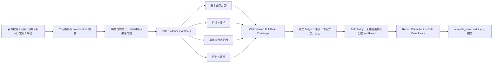

# `stock-analysis-debate` Skill 专业评估与优化建议

> 评估日期：2026-08-05  
> 评估对象：`skills/stock-analysis-debate/` 当前工作区版本（含尚未提交的本地改动）  
> 评估视角：股票研究方法、数据可信度、估值与评级、组合风险、跨市场适配、Agent 编排、测试与可运营性  
> 评估性质：只读审计；本文没有修改 Skill、prompt 或工具代码

## 一、结论先行

`stock-analysis-debate` 已经明显高于普通的“新闻 + 技术指标 + 多空辩论”类股票分析 Skill。它最有价值的能力不是多 Agent 数量，而是以下四点：

1. 对财务期间、币种、TTM 连续性和来源边界建立了确定性检查；
2. 将价格归因从“事后找新闻”升级为“预期基线 → 触发/意外 → 传导/放大 → 异常收益 → 基本面锚 → 条件展望”；
3. 对缺失证据明确输出 `Not Rated`，并限制社交、期权、资金身份等弱证据进入评级；
4. 用独立文件和按需读取控制多 Agent 上下文，流程产物可审计、可追溯。

但从专业股票研究和实际投资决策的标准看，它目前仍应定位为：

> **有较强数据纪律的研究原型，而不是可直接依赖的生产级股票评级与仓位决策系统。**

核心原因不是“分析不够多”，而是五个基础合同尚未闭合：

- 数值授权合同宣称约束“所有数字”，实际只覆盖少量基本面、估值和一致预期指标；
- 目标价和强评级 gate 在授权数据为空时仍可能错误开启；
- 期权成交量/未平仓量被错误推断为“新开仓”和方向性资金；
- 在没有用户组合、风险预算和持仓背景时，系统仍会给出高度集中的单股仓位；
- 历史日期分析会混入检索时点的财务报表、`info` 和一致预期，存在前视偏差。

因此，当前版本不宜继续通过增加更多 Agent、辩论轮次或指标来优化。正确顺序是先修复上述 P0 合同，再增强估值、行业比较和跨市场数据，最后做工作流前向评测。

## 二、综合评分

| 维度 | 评分 | 评价 |
|---|---:|---|
| 价格行为归因 | 8.5/10 | 是当前最成熟部分；有预期、时序、异常收益、竞争假设和证据分级 |
| 财务口径与币种纪律 | 7.5/10 | TTM、FX、GAAP/派生口径、分部抵销规则较扎实，但授权范围和官方数据勾稽未闭环 |
| 数据来源与时点完整性 | 5.5/10 | 有来源层级意识；主数据仍高度依赖 yfinance，历史回看存在前视偏差 |
| 基本面研究深度 | 6.0/10 | 能读三表和分部，但缺少注释、资本回报、稀释、会计质量、产业与竞争结构的标准框架 |
| 估值与目标价 | 4.0/10 | 有币种和期间 gate，但缺少模型路由、可比公司选择、敏感性与目标价 artifact |
| 评级体系 | 4.5/10 | 五档名称齐全，但绝对/相对语义、基准、期限、回报阈值及三档交易信号映射不一致 |
| 组合风险与执行 | 3.5/10 | 有分批和止损算术，但缺少投资者画像、组合相关性、风险预算、流动性与适当性边界 |
| 多 Agent 编排 | 6.5/10 | 文件化共享记忆和按需读取较好；存在停止策略、角色依赖和工具能力表述冲突 |
| 测试与评测 | 5.5/10 | 148 个工具/静态测试全部通过，但缺端到端编排、claim audit、gate compliance 和历史时点测试 |
| Skill 工程质量 | 6.5/10 | `SKILL.md` 结构清晰且 445 行仍在建议上限内；旧工具名、运行时绑定和缺少 UI metadata 降低可移植性 |

**综合：6.2/10。** 研究纪律已有良好骨架，但在修复 P0 前，评级、目标价和仓位不能被视为可靠交付。

## 三、本次评估方法与验证结果

本次检查覆盖：

- `SKILL.md` 的七阶段执行合同、失败策略、输入输出和最终报告模板；
- 16 个角色 prompt；
- 14 个 Python 工具和 16 个测试文件；
- 现有 01810.HK、601138.SH、BABA 报告作为历史回归样本；
- 当前 Skill 静态校验、完整工具测试、Python 编译检查和 Git 差异检查；
- FINRA、SEC、OCC/OIC、CFA Institute、yfinance 官方项目说明等外部基准。

当前验证结果：

| 检查 | 结果 | 能证明什么 | 不能证明什么 |
|---|---|---|---|
| Skill `quick_validate.py` | 通过 | frontmatter 和基本命名有效 | 工作流可运行、研究结论正确 |
| 工具测试 | `148 passed` | 当前单元和静态断言通过 | Agent 真正遵守 prompt、报告不越过 gate |
| Python `compileall` | 通过 | Python 文件可编译 | 网络数据语义和研究逻辑正确 |
| `git diff --check` | 通过 | 无空白字符类 diff 错误 | 不代表当前未提交修改已完成回归验证 |

需要特别强调：当前工作区存在较大范围的未提交改动。本文按“当前磁盘内容”评估，不把现有历史报告当作当前代码已重新生成的结果。

## 四、值得保留的设计

### 4.1 价格归因框架专业度较高

`prompts/price_action_attribution_analyst.md:9-18` 强制区分预期、触发、放大、价格反应和基本面持续性；`45-70` 又限制事后归因、身份推断、逼空、强平和媒体重复。这比常见的“找一条附近新闻解释涨跌”可靠得多。

建议保留：

- 1/5/20 日绝对与相对收益；
- 事件时间线和事件日/发布日期分离；
- 至少一个竞争性解释；
- A/B/C/Rejected/Not Rated 证据等级；
- “价格状态不是催化剂”“没有事前预期就不能声称 surprise”；
- 不让归因角色直接给评级、目标价和仓位。

### 4.2 财务口径防错规则切中了真实高频错误

`prompts/fundamentals_analyst.md:7-16` 和 `tools/financial_audit.py` 已覆盖：

- 季度列不能当全年；
- TTM 必须是四个连续季度；
- P/B、EV/EBITDA 要统一币种；
- `Total Operating Income As Reported` 不等同于派生 `Operating Income`；
- provider TTM 与报表推导值需要对账；
- 分部预抵销收入和合并收入不能混用。

这些规则应继续下沉到工具层，而不是退回 LLM 自行判断。

### 4.3 `Not Rated` 和 fail-closed 方向正确

社交、期权、比较器、事前一致预期、卖空/杠杆/资金身份等证据缺失时明确降级，是当前 Skill 的重要竞争力。尤其是 `SKILL.md:28-32` 和 `prompts/data_policy.md`，已经建立“缺失不是零，也不是反向证据”的正确意识。

### 4.4 文件化产物和按需读取适合复杂流程

`SKILL.md:44-67`、`186-238` 将数据和报告分树存放，并让角色直接写各自文件；`58-67` 的按需读取协议能降低主会话上下文污染。应保留用户已固定的目录合同：

```text
skills/stock-analysis-debate/reposrts/{TICKER}/data/{DATE}/
skills/stock-analysis-debate/reposrts/{TICKER}/reports/{DATE}/
```

`reposrts` 是现有明确合同，不建议在本轮优化中顺手改名。

### 4.5 重试、结构化 I/O 与原子写入是良好工程基础

`provider_runtime.py` 对临时网络错误分类重试并留下审计事件；`structured_io.py` 对 TOON/JSON 做严格 round-trip 和原子替换。这些确定性机制比单纯依靠 prompt 可靠，应继续保留。

## 五、P0：必须优先修复的问题

### P0-1：全局数值授权合同与真实分析输入不一致

#### 现状

`SKILL.md:29`、`199`、`324-333` 和 `prompts/data_policy.md:1-10` 声称所有数值必须来自 `validated_metrics`，原始文件不能授权数字。

但 `tools/data_validation.py:290-360` 实际主要收录：

- 最新季收入/盈利同比；
- 当前价、TTM EPS、P/E、P/B、EV/EBITDA；
- yfinance 的分析师预期表；
- 少量 SEC XBRL 交叉核对值。

以下大量最终报告必需数字并不在这个合同中：

- OHLCV、1/5/20 日收益、异常收益、成交量；
- SMA、EMA、MACD、RSI、ATR、布林带；
- FRED 宏观指标、预测市场概率；
- 期权 volume/OI/IV；
- 大部分资产负债表、利润表和现金流量表项目；
- 新闻中的正式公告数值和分部数据。

因此，代理只能在两个错误选择中二选一：

1. 严格守合同，导致技术、宏观、价格归因和大部分基本面分析无法输出数字；
2. 使用角色原始 artifact，违反“所有数字只允许来自 `validated_metrics`”的总规则。

#### 风险

这是架构级矛盾，会造成不同 Agent 对“授权数字”的理解不一致，也让最终 gate 无法真实覆盖所有 claim。

#### 建议

短期采用“分域授权合同”，不要假装一个不完整文件覆盖全部数字：

| 领域 | 权威 artifact | 允许用途 |
|---|---|---|
| 财务、估值、一致预期 | `validated_metrics` | fundamentals、valuation、forecast |
| 行情与相对收益 | `price_context` + `data_quality` | price attribution、technical context |
| 技术指标 | 新增 `validated_indicators` 或在 `data_quality` 内逐项授权 | technical、risk reference |
| 宏观 | 新增 `validated_macro` | macro context，不直接授权个股目标价 |
| 期权 | 新增 `validated_options` | market-implied context，不授权交易方向 |
| 新闻/公告 | evidence ID + content level + event/publication time | narrative facts、event attribution |

中期再合并为统一 `evidence_registry`，每条 claim 至少包含：

```text
claim_id / value / unit / currency / period / as_of / retrieved_at
source / source_tier / status / allowed_uses / prohibited_uses
formula / input_claim_ids / quality_flags
```

#### 验收标准

- 最终报告中的每一个物质性数字都能反查到一个明确授权 artifact 和 claim ID；
- 不再使用“raw provider values 一律禁止”这种与实际工作流冲突的笼统规则；
- 删除任一领域 artifact 后，该领域稳定降级为 N/A/Not Rated，不影响其他领域。

### P0-2：目标价与强评级 gate 会在输入无效时错误开启

#### 可复现问题

`tools/data_validation.py:372-384` 的 gate 就绪判断使用：

- `statement_ttm_diluted_eps is not None`；
- `earnings_estimate` 列表非空；
- `conflicts` 列表为空。

但它没有验证：

- P/E metric 本身是否可用；
- EPS 是否为正且适合 P/E 方法；
- 一致预期的核心数值、币种、期间和分析师数量是否有效；
- 目标价模型是否存在；
- 估值输入的 `allowed_uses` 是否包含 `target_price`；
- 官方值和 provider 值是否真的完成冲突检测。

本次只读复现中，将 TTM EPS 设为 `0`、P/E 设为 `None`、`earnings_estimate` 仅保留一条 `avg=None` 的记录，代码仍输出：

```text
allow_exact_pe: true
allow_target_price: true
allow_strong_rating: true
point_in_time_pe: unavailable
earnings_estimate.0y.avg: unavailable
```

另外，`data_validation.py` 虽然定义了 `conflict` status，当前生产代码没有任何路径真正把 metric 标为 `conflict`；`not conflicts` 基本恒为真。

#### 建议

gate 必须从“上游容器存在”改成“所需 claim 集合全部满足”：

```text
allow_target_price =
  valuation_model.status == verified
  AND horizon is explicit
  AND every required input.status in {verified, accepted_single_source}
  AND every required input.allowed_uses contains target_price
  AND currency/period/as_of are compatible
  AND sensitivity output exists
  AND no blocking conflict exists
```

`allow_strong_rating` 不应由“有 P/E + 有一致预期”决定。评级强度应来自独立的 decision policy，至少考虑：证据覆盖率、估值可信度、催化与风险、相对基准、时点一致性和组合适用边界。

每个 gate 应输出结构化原因，而不是只有布尔值：

```json
{
  "allowed": false,
  "blocking_reasons": ["ttm_eps_unavailable", "forecast_currency_missing"],
  "required_claim_ids": ["..."],
  "checked_at": "..."
}
```

#### 验收标准

- EPS 为 0、负数、缺失或 P/E unavailable 时，P/E 型目标价 gate 必须关闭；
- 一致预期表非空但有效值为空时，目标价和强评级 gate 必须关闭；
- 构造任一跨来源冲突后，`conflicting_metrics` 非空且相关 gate 关闭；
- 对每个 gate 做参数化和 property-based 测试。

### P0-3：期权 volume/OI 不能证明“新开仓”或资金方向

#### 现状

`tools/options_flow.py:46-47`、`169-189` 将 `volume > 2 × OI` 标为 `freshly opened positions`；`prompts/options_flow_analyst.md:15` 进一步将 heavy fresh put/call volume 解释为新部署的看空/看多资金。

这是方法学错误。期权当日成交量是交易活动，未平仓量是清算后仍未平仓的合约数。单凭某一时点的 volume 与前一日 OI，无法知道买卖双方分别是开仓还是平仓，也无法知道主动买方方向或机构身份。OIC/OCC 的说明明确指出，OI 的变化取决于买卖双方各自的 open/close 标记，需在日终清算配对后才能确认。[OIC 关于成交量与未平仓量的解释](https://www.optionseducation.org/referencelibrary/faq/general-information)

#### 建议

- 删除 `fresh_*` 命名，改为 `high_volume_relative_to_prior_oi`；
- 输出必须写明“异常活动，开平仓方向未知”；
- 不得把 call volume 自动解释为看多、put volume 自动解释为看空；
- 没有逐笔方向、bid/ask execution、开平仓标记和 OI 次日变化时，不输出资金方向；
- 将 IV skew 定义为同到期、近似 delta/moneyness 的可比结构，不只按固定 ±5% spot 选最近 strike；
- 对 earnings/event expiry、零 DTE、宽价差、陈旧 quote 增加降级条件；
- 期权层默认只描述“定价和活动结构”，不直接授权评级、目标价或仓位。

#### 验收标准

- 全项目不再出现 `freshly opened positions`；
- volume/OI 异常只输出 activity flag；
- 只有具备可验证开平仓/方向数据时才允许方向性 flow claim；
- 加入“同样 volume/OI、不同 open/close 组合会产生不同 OI”的测试。

### P0-4：没有组合画像时不应给出单股仓位比例

#### 现状

当前 prompt 只在组合资本未知时把金额和股数设为 N/A，但仍要求 Agent 给出最大仓位百分比。百分比同样依赖组合语境，至少需要：

- 当前持仓和成本；
- 总资产、可投资资金和现金需求；
- 单股/行业/国家/币种上限；
- 最大可承受回撤和风险预算；
- 投资期限、流动性需求和杠杆/做空权限；
- 与现有组合的相关性和因子暴露。

历史回归样本 `601138.SH/reports/2026-08-04/analysis_report.md:7-15` 曾给出单股最大仓位 90%，风险辩论只是在 80%/90%/100% 中折中。该报告早于当前未提交改动，不能证明当前版本一定仍会这样输出；但它非常适合作为必须永久防回归的测试案例。

#### 建议

将“证券研究结论”和“个性化组合配置”分开：

- 默认输出：评级/观点、风险情景、验证节点，不输出具体组合仓位；
- 用户没有提供完整 portfolio context：`Position Size = Not Rated`；
- 若用户明确要求 model portfolio，可使用明确披露的假设组合，但不能伪装成个人建议；
- 若提供完整组合数据，使用风险预算法，而不是由三个风险角色投票：
  - 单笔风险预算；
  - 波动率/ATR 归一化；
  - 流动性和跳空压力测试；
  - 行业/因子/币种集中度；
  - 相关性和边际风险贡献；
  - stress loss 与最大回撤约束。

SEC 对分析师建议的投资者教育材料也强调，证券观点并不等于针对个人财务状况的适合性判断，投资者目标、期限和风险承受能力不可省略。[SEC：Analyzing Analyst Recommendations](https://www.sec.gov/about/reports-publications/investorpubsanalystshtm)

#### 验收标准

- 无 portfolio context 时，报告不再输出 10%、25%、90% 等仓位建议；
- 不因“多 Agent 一致”提高仓位；
- 有组合输入时，所有仓位都能追溯到风险预算公式和约束检查。

### P0-5：历史日期分析存在前视偏差

#### 现状

Skill 支持任意 `date`，但多个数据源是检索时点快照：

- `stock.info`；
- 当前可见的季度报表；
- 当前分析师一致预期、EPS trend/revisions；
- insider 数据和部分新闻搜索结果。

`data_validation.py:48-110` 虽记录 `analysis_date` 与 `retrieved_at`，并未证明这些值在 `analysis_date` 当时已经公开。官方 SEC filings 会按 filing date 过滤，这是正确方向；yfinance 财务表和 `info` 没有同等 point-in-time 约束。

因此，当用户回看历史日期时，报告可能使用当时尚未发布的财报或后来修订的一致预期，产生 look-ahead bias。

#### 建议

显式拆分两种模式：

1. `current_research`：只允许分析当前时点，`DATE` 用作执行日期；
2. `historical_replay`：仅允许具备 `published_at/filed_at <= analysis_timestamp` 的数据，无法 point-in-time 的 provider 字段全部 Not Rated。

每个 claim 必须同时记录：

```text
period_end / published_at(or filed_at) / retrieved_at / analysis_timestamp
```

对历史回放，不能只用 period end 判断可见性。

#### 验收标准

- 将分析日回拨到某财报 filing date 前一天，相关财务事实必须不可见；
- retrieval-time target/recommendation 不得进入历史评级和 surprise 判断；
- 无 point-in-time 能力的数据源在历史模式自动降级。

## 六、P1：完成 P0 后应修复的问题

### P1-1：估值框架不足以支撑专业目标价

当前有 P/E、P/B、EV/EBITDA 和情景表，但没有一套按公司类型选择估值模型的明确规则。`SKILL.md:348` 还要求把技术形态与估值目标交叉验证，容易把短期技术阻力误写成 12 个月公允价值。

专业报告中的评级和目标价应有合理基础、明确估值方法、时间期限、基准和阻碍目标实现的风险；FINRA Rule 2241 可作为质量基准，而不是声称本 Skill 必然受该规则直接管辖。[FINRA Rule 2241，研究报告内容要求](https://www.finra.org/rules-guidance/rulebooks/finra-rules/2241)

建议建立估值路由：

| 公司类型 | 主模型 | 交叉验证 | 关键检查 |
|---|---|---|---|
| 稳定盈利工业/消费 | FCFF/FCFE DCF | EV/EBITDA、P/E peers | ROIC、再投资、WACC、终值 |
| 银行/保险 | Residual Income / DDM | P/B-ROE、P/E | 资本充足率、信用成本、净息差 |
| 高成长/亏损公司 | 情景化 EV/Sales | unit economics、毛利/FCF 路径 | 稀释、现金 runway、盈利拐点 |
| 多业务集团 | SOTP | consolidated DCF | 分部口径、少数股东、净债务 |
| REIT | NAV / AFFO | P/AFFO、cap rate | 租约、利率、资产估值 |
| 周期股 | mid-cycle earnings/NAV | EV/EBITDA、replacement cost | 周期中枢、库存、供需 |

目标价 artifact 至少包含：模型、预测期、估值日、目标期限、货币、股本口径、净债务、少数股东、关键假设、base/bull/bear 敏感性、输入 claim IDs 和风险。

CFA Institute 的估值框架强调将预测转换为估值时需要敏感性分析，relative valuation 需要明确可比基准；DCF 与相对估值可能给出不同结论，不能简单互相“确认”。[CFA Institute：Equity Valuation Applications and Processes](https://www.cfainstitute.org/insights/professional-learning/refresher-readings/2026/equity-valuation-applications-and-processes)、[Damodaran：Reconciling DCF and Relative Valuation](https://pages.stern.nyu.edu/~adamodar/New_Home_Page/littlebook/reconcilingdcfandrelative.htm)

### P1-2：评级体系的绝对/相对语义冲突

`portfolio_manager.md:11-16` 将 Buy/Overweight/Hold/Underweight/Sell 混在同一尺度：

- Buy/Sell 偏绝对动作；
- Overweight/Underweight 天然是相对基准/组合权重；
- Hold 又依赖用户是否已有持仓。

同时 Research Manager 和 Trader 只输出 BUY/HOLD/SELL，最终 Portfolio Manager 输出五档，缺少映射。`SKILL.md:273`、`283` 与 `343` 之间因此存在语义断层。

建议二选一：

1. **研究评级**：Outperform / Neutral / Underperform，必须定义 12 个月基准和预期超额收益阈值；
2. **绝对观点**：Positive / Neutral / Negative，不直接暗示用户交易动作。

如坚持五档制，必须对每档明确：

- 时间期限；
- 对应基准；
- 预期绝对/超额回报区间；
- 风险调整规则；
- 三档中间层到五档最终层的确定性映射。

FINRA 的质量要求同样强调评级定义必须说明期限和基准，且含义与通常语义一致。[FINRA Rule 2241(c)(2)](https://www.finra.org/rules-guidance/rulebooks/finra-rules/2241)

### P1-3：工作流合同存在互相冲突的指令

主要冲突包括：

1. `SKILL.md:42`、`228`、`238`、`264` 要求重试失败后停止；`419` 又要求 Analyst 失败时记录后继续；
2. Segment Analyst 与 Fundamentals Analyst 在同一批并行，`fundamentals_analyst.md:5` 却要求在收到 Segment 报告时整合，正常流程下不可能发生；
3. `market_analyst.md:25` 要求调用不存在于当前文件式工作流的 `get_stock_data/get_indicators`；
4. `fundamentals_analyst.md:1` 要求调用 `get_fundamentals/get_balance_sheet/get_cashflow/get_income_statement`，与当前传文件方式冲突；
5. `SKILL.md` 强绑定 `Agent/Read/Write/Bash` 等具体工具名和 “SINGLE message / SAME batch”，降低不同 Agent runtime 的可移植性；
6. `SKILL.md:311` 要求文件写入和最终文本处于同一 tool batch，属于运行时实现细节，不应作为研究正确性的完成条件。

建议：

- 以一个显式状态机定义阶段、前置产物、retry 和 terminal state；
- 失败策略只保留一处真相源；
- prompt 只描述可用文件和能力，不写不存在的旧工具；
- 将“最终报告落盘 + 用户可见摘要”定义为同一 turn 的两个 deliverable，不绑定具体 batch 语法；
- 增加 fake agent/fake file store 的 trace test，验证偏序和失败分支。

### P1-4：官方披露尚未真正成为主要财务真相源

当前 `source_priority` 把官方结构化披露放首位，这是正确方向；但真实执行中：

- US 只有少量 SEC Company Facts 被规范化，而且只标记为 `official_fundamental_cross_check`；
- HKEX/CNINFO 主要发现 PDF/公告链接，不做结构化数值摄取；
- 核心估值、财务表和一致预期仍主要来自 yfinance；
- 官方值和 provider 值还没有统一的 reconciliation engine。

SEC Company Facts 的事实包含 taxonomy、unit 和不同 filing context；季度、年度和时点值必须按 duration/instant、form、fiscal period、filed date 和 amendment 选择。当前 `_sec_official_metrics` 主要按最新 filed/end 取值，没有充分保留 start/frame/context，可能把年度与季度 duration 混在同一个“official_revenue”语义中。SEC 官方 API 文档也明确区分 annual、quarterly 和 instantaneous period。[SEC EDGAR APIs](https://www.sec.gov/search-filings/edgar-application-programming-interfaces)

建议：

- US：按 filing accession + fiscal period + start/end/frame 做 statement builder；
- HK：优先公司 results announcement/annual/interim report 的结构化表或可信解析层；
- CN：优先交易所/巨潮定期报告与业绩预告，区分已审计、未经审计和预告；
- 把公告正文/财务注释中的数字摄取放在确定性 parser/OCR + schema validation 层，LLM 只做叙事解释；
- 所有 provider 数字与官方数字按 metric/period/currency 自动勾稽，冲突进入 gate。

`yfinance` 官方项目说明自身也明确其面向研究/教育用途、与 Yahoo 无隶属关系，且 Yahoo 数据使用权需遵守相关条款；这意味着它适合 fallback/便利数据层，不适合作为“生产级研究唯一真相源”。[yfinance 官方项目说明](https://github.com/ranaroussi/yfinance)

### P1-5：测试通过，但没有测试“报告是否真的守规则”

`test_price_attribution_workflow.py` 主要检查关键字符串和章节顺序；它没有执行真实 Agent 编排。现有测试也没有系统验证：

- 最终报告每个数字是否有合法 claim ID；
- gate=false 时是否绝不出现目标价/强评级；
- prompt 冲突时 Agent 实际选择哪条指令；
- 角色写入、重试、停止的真实 trace；
- 日期回拨时是否出现未来数据；
- 同一证据在 bull/bear 中是否被歪曲；
- 不同模型/温度下评级稳定性；
- 历史已知错误是否永久防回归。

建议建立四层评测：

1. **工具单元测试**：现有 148 个测试继续保留；
2. **合同/性质测试**：gate、币种、期间、缺失、冲突、历史时点；
3. **编排 trace 测试**：fake tools + fake agents + fake file store；
4. **报告 claim audit**：解析最终 Markdown，逐条核对数字、来源、gate、公式和评级定义。

优先把以下历史样本固化为 regression fixtures：

- 01810.HK：`allow_target_price=false` 时报告仍出现精确目标价和被 gate 禁止的 TTM P/E；
- 601138.SH：无 portfolio context 时输出 90% 单股仓位；
- BABA：volume/OI 被写成 fresh put/call positioning；
- 财报缺一个季度时禁止 TTM；
- HKD/CNY 混用时禁止 P/B、EV/EBITDA 和每股目标价。

### P1-6：跨市场适配还停留在交易规则层

当前跨市场差异主要是 ticker、币种、涨跌停、交收和 lot size。真正的专业研究还需要：

| 市场 | 应补充的核心数据/规则 |
|---|---|
| US | SEC filings、GAAP/non-GAAP reconciliation、SBC/稀释、13F/short interest、earnings calendar、行业 ETF/peers |
| CN | 交易所公告、业绩预告/快报、复权与除权、北交所/创业板/科创板不同规则、融资融券/北向口径、停牌/ST/退市风险 |
| HK | HKEX 披露、H股/红筹/ADR 映射、南向资金、配股/供股/回购、不同投票权、HKD/CNY 财务币种、board lot 与碎股 |

FRED 只覆盖美国宏观，不能成为 CN/HK 个股的唯一宏观锚。至少应按市场路由利率、汇率、PMI、信用和流动性数据，并明确宏观变量是背景、估值输入还是事件触发。

## 七、P2：质量和效率优化

### 7.1 无真实社交数据时跳过 Social Media Analyst

当前 Social Media Analyst 对同一个 `news.txt` 再做一次分析，绝大多数情况下只输出 Not Rated，且与 News Analyst 重复。应在 Phase 1 就读取 `social_data_available`：

- false：不启动该 Agent，只生成确定性 Not Rated marker；
- true：必须有真实平台帖子、样本范围、抓取时间、去重与代表性说明后才运行。

### 7.2 依赖应锁版本并记录运行环境

`requirements.txt` 对 yfinance、pandas、stockstats 等只设最低版本，外部字段和默认行为变化可能破坏结果复现。建议使用 lockfile 或约束文件，并在每次报告 metadata 中记录：

- Python 和依赖版本；
- provider/library version；
- prompt hash；
- Skill/worktree revision；
- data retrieval timestamps。

### 7.3 增加同行和行业层，而不是继续增加辩论轮次

当前基本面角色偏单公司，Price Attribution 虽要求 peers，但没有稳定的 peer selection 和同口径数据。建议增加确定性的 peer universe artifact：

- 选择依据：业务相似度、收入地域、规模、盈利模式、资本结构；
- 同一币种/期间/会计口径；
- growth、margin、ROIC、leverage、valuation、estimate revisions；
- 明确剔除不可比项。

两轮 Bull/Bear 加两轮三方 risk debate 已经足够。新增价值更高的是高质量同行数据和独立 judge，而不是更多角色。

### 7.4 Debate 应用于找漏洞，不应用“共识票数”决定真相

Bull/Bear 固定立场有助于发现反例，但也会诱导选择性取证。建议：

- Bull/Bear 只能提交 claim + evidence + counterevidence；
- 独立 judge 不知道哪一方先发言，按 claim 评分；
- 禁止用“全部 6 个角色一致”作为信心或仓位依据；
- 争议未解决时保留 dissent，不强行折中成一个数字；
- 用 blind replay 测试交换 Bull/Bear 顺序后评级是否稳定。

### 7.5 补充 Skill UI metadata，但放在最后做

当前没有 `agents/openai.yaml`。如果该 Skill 要作为 Codex 可发现/可分发 Skill 使用，可在核心流程稳定后补充 `display_name`、`short_description`、`default_prompt`。这不是研究正确性的前置条件，优先级低于 P0/P1。

## 八、建议的目标架构



设计原则：

- Agent 负责解释、生成假设和挑战；
- 工具负责数字、日期、币种、公式、来源和 gate；
- Judge 负责裁决证据，不以角色票数为依据；
- Portfolio policy 负责组合适用性，不能由研究角色代替；
- 最终 claim audit 是发布闸门，而不是格式检查。

## 九、按文件给出的具体修改建议

| 文件 | 建议 | 优先级 |
|---|---|---:|
| `tools/data_validation.py` | 重写 gate prerequisites；实现真实 conflict reconciliation；拆分/扩展分域授权；加入原因码 | P0 |
| `tools/options_flow.py` | 删除 fresh-position 推断；改 activity flag；记录 quote freshness/spread；改用可比 delta/moneyness | P0 |
| `prompts/options_flow_analyst.md` | 禁止从 volume/OI 推断开平仓、主动方向和机构身份 | P0 |
| `prompts/data_policy.md` | 将“所有数字只能来自一个文件”改为“按领域使用授权 artifact” | P0 |
| `prompts/portfolio_manager.md` | 无 portfolio context 时仓位 Not Rated；明确评级期限/基准；只消费 valuation artifact | P0/P1 |
| `SKILL.md` | 消除 stop/continue 冲突；明确 gate 到评级的映射；增加 current/historical 模式；去除 runtime-specific batch 指令 | P0/P1 |
| `prompts/market_analyst.md` | 删除旧 `get_stock_data/get_indicators` 工具说明；按已生成 artifact 工作 | P1 |
| `prompts/fundamentals_analyst.md` | 删除旧工具名和“过去一周”表述；加入资本回报、现金转换、稀释和会计质量模板 | P1 |
| `prompts/research_manager.md`、`trader.md` | 与五档评级统一或只输出观点，不制造三档到五档语义断层 | P1 |
| `tools/official_filings.py` | 继续官方披露发现，并为 HK/CN 增加结构化摄取路径 | P1 |
| `tools/data_validation.py::_sec_official_metrics` | 按 form/fp/start/end/frame/accession 区分 instant、季度和年度值 | P1 |
| `tools/tests/` | 增加 gate property、historical replay、claim audit、trace 和三个历史回归样本 | P1 |
| `requirements.txt` | 锁关键依赖版本，记录 runtime manifest | P2 |
| `agents/openai.yaml` | 核心逻辑稳定后生成 UI metadata | P2 |

## 十、推荐实施顺序

### 第一批：封住错误结论

1. 修复 gate 空值漏洞与真实冲突检测；
2. 将数值政策改为分域授权；
3. 删除期权“新开仓”推断；
4. 无组合画像时仓位一律 Not Rated；
5. 历史日期默认 fail closed；
6. 将 01810.HK、601138.SH、BABA 固化为报告级回归测试。

### 第二批：补齐专业研究方法

1. 定义评级期限、基准和阈值；
2. 建立公司类型 → 估值模型路由；
3. 生成结构化 valuation artifact 和敏感性分析；
4. 增加同行/行业 artifact；
5. 官方披露与 provider 数据自动勾稽；
6. 加入会计质量、ROIC、稀释、资本配置和现金转换分析。

### 第三批：提高工作流稳定性和效率

1. 用状态机统一阶段/重试/停止合同；
2. 清理 prompt 中不存在的工具和重复说明；
3. 无社交数据时跳过 Social Agent；
4. 增加真实 Agent forward test、盲测和顺序交换测试；
5. 最后再做 progressive disclosure、UI metadata 和依赖锁定。

## 十一、上线前验收清单

### 数据与时点

- [ ] 每个物质性数字都有 claim ID、来源、期间、币种、as-of 和 retrieved-at；
- [ ] 历史模式不存在 filing date 之后的数据；
- [ ] 官方/provider 冲突会形成结构化 conflict 并关闭相关 gate；
- [ ] 缺失季度不能形成 TTM；
- [ ] 跨币种估值没有 dated FX 时自动 N/A。

### 估值与评级

- [ ] 目标价对应明确模型、期限、假设和敏感性；
- [ ] `allow_target_price=false` 时 Markdown 中不存在精确目标价；
- [ ] 每档评级有期限、基准和阈值；
- [ ] 技术阻力位不会被包装成长期内在价值；
- [ ] 强评级不由 Agent 共识票数决定。

### 风险与执行

- [ ] 无组合画像时不输出具体仓位；
- [ ] 做空建议验证市场/账户可做空性、借券与成本，否则 Not Rated；
- [ ] 仓位考虑相关性、集中度、流动性、跳空和 stress loss；
- [ ] 战术止损与长期论点失效条件分开；
- [ ] A/H/US 市场规则按标的实际板块和证券类型路由。

### 期权与归因

- [ ] volume/OI 不再被称为新开仓；
- [ ] 无交易方向和开平仓数据时不推断 bullish/bearish flow；
- [ ] 无事前预期时不声称 surprise/priced-in；
- [ ] 无比较器时不声称 abnormal return；
- [ ] 无融券/杠杆/逐笔流数据时不推断投资者身份、逼空或强平。

### 编排与发布

- [ ] fake trace 验证所有 Phase 偏序、重试和停止分支；
- [ ] Segment/Fundamentals 依赖没有并行矛盾；
- [ ] prompt 不引用不存在的工具；
- [ ] 最终 report claim audit 通过后才发布；
- [ ] 三个市场至少各有两个成功样本和两个故障降级样本。

## 十二、最终判断

这个 Skill 的优化方向不应是“继续堆更多专家角色”，而应是：

> **把现有优秀的证据纪律，升级为端到端可执行、可测试、不会被最终报告绕过的研究合同。**

建议保留七阶段主流程、Price Action Attribution、Not Rated、币种/TTM 审计、分部勾稽和按需读取；优先重做数值授权、gate、期权语义、历史时点和仓位政策。完成这些 P0/P1 后，它才具备从“高质量研究原型”升级为“可重复、可审计的专业股票研究 Skill”的基础。

## 参考基准

- [FINRA Rule 2241：Research Analysts and Research Reports](https://www.finra.org/rules-guidance/rulebooks/finra-rules/2241)
- [SEC：Analyzing Analyst Recommendations](https://www.sec.gov/about/reports-publications/investorpubsanalystshtm)
- [SEC：EDGAR Application Programming Interfaces](https://www.sec.gov/search-filings/edgar-application-programming-interfaces)
- [SEC：Beginners' Guide to Financial Statements](https://www.sec.gov/about/reports-publications/beginners-guide-financial-statements)
- [OIC/OCC：General Information — Volume and Open Interest](https://www.optionseducation.org/referencelibrary/faq/general-information)
- [CFA Institute：Equity Valuation Applications and Processes](https://www.cfainstitute.org/insights/professional-learning/refresher-readings/2026/equity-valuation-applications-and-processes)
- [Aswath Damodaran：Reconciling DCF and Relative Valuation](https://pages.stern.nyu.edu/~adamodar/New_Home_Page/littlebook/reconcilingdcfandrelative.htm)
- [yfinance 官方项目说明](https://github.com/ranaroussi/yfinance)
