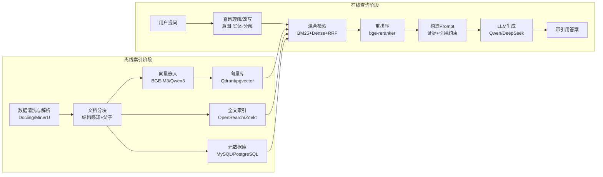

# 企业级 RAG 全链路选型调研报告

> 报告类型：**技术选型（对比选型型）**。读者任务：在 RAG 全链路各环节的多个开源候选间，做出有据可查的选型决策。
> 结论确定性标注：**已确认**（官方文档/权威 benchmark）｜**社区共识**（主流评测/生产案例）｜**待验证**（需在企业语料自测）。

---

## 1. 摘要与推荐

### 1.1 一句话结论

**通用企业 RAG 默认选 `Docling/MinerU + 结构感知分块 + BGE-M3 或 Qwen3-Embedding + Qdrant/pgvector + OpenSearch/Zoekt 全文 + Hybrid(RRF) + bge-reranker + Qwen/DeepSeek 生成`；代码场景追加 Zoekt+LSP/SCIP，多跳场景追加 GraphRAG。**

### 1.2 推荐总表（结论前置）

| 环节 | 首选 | 备选 | 一句话理由 |
|---|---|---|---|
| 数据解析 | **Docling / MinerU** | Unstructured / LlamaParse | 复杂版面表格精度高、Apache-2.0 可自托管 |
| 分块 | **结构感知 + 父子文档** | Late Chunking / 语义分块 | 召回精 + 上下文全，成本收益比最优 |
| Embedding | **BGE-M3**（中英一体） | Qwen3-Embedding-4B | 中文强、dense+sparse 一模型两用 |
| 全文索引 | **OpenSearch/ES**（通用）· **Zoekt**（代码） | Meilisearch | 精确实体/符号/错误码检索不可省 |
| 向量库 | **Qdrant**（默认）· **pgvector**（已用 PG） | Milvus（超大规模） | 过滤强/权限一体，中规模最优 |
| 召回融合 | **BM25 + Dense + RRF** | + Sparse/SPLADE | 零样本强基线 + 语义补足，简单稳定 |
| 重排序 | **bge-reranker-v2-m3** | Qwen3-Reranker-4B | 与 BGE-M3 闭环、中文强、MIT |
| LLM 生成 | **Qwen3 / DeepSeek**（自托管） | Claude / GPT（托管） | 中文强、成本可控；质量上限走托管 |
| 编排平台 | **RAGFlow**（开箱）· **LlamaIndex/Haystack**（自研） | Dify / LangGraph | 开箱即用 vs 深度定制二选一 |
| 评估观测 | **RAGAS** + 人工 gold evidence | Langfuse + DeepEval | 自动评估 + 全链路 trace |

### 1.3 关键发现 TOP 5

| # | 发现 | 支撑 | 影响 |
|---|---|---|---|
| 1 | **首阶段召回决定上限，Reranker 只重排不找回漏召回** | Azure RAG 检索指南【已确认】 | 先做高 `Recall@100`，再上 Reranker |
| 2 | **BM25 零样本检索仍是强基线，不能只靠向量** | BEIR benchmark【已确认】 | 精确实体/错误码/符号必须走全文索引 |
| 3 | **BGE-M3 一个模型同时给 dense+sparse**，省一套稀疏检索 | 官方模型卡【已确认】 | 中文场景默认，降架构复杂度 |
| 4 | **Qwen3-Embedding-8B 多语言 MTEB Retrieval 70.58 第一**，但 4B→8B 增益约 1 分 | 官方 benchmark 快照【已确认】 | 4B 更值得先做生产验证 |
| 5 | **ACL/租户/版本过滤必须在检索层执行**，不能检索后再隐藏 | Azure 安全多租户 RAG【已确认】 | 安全边界 = 检索约束 |

---

## 2. 评估背景

### 2.1 目标场景

| 场景 | 核心诉求 | 关键差异点 |
|---|---|---|
| 代码知识库 | 精确符号/正则/版本绑定 | 需要 LSP/SCIP + Zoekt 类符号检索 |
| 通用文档问答 | 多格式、中文、权限 | 解析精度 + 多租户过滤 |
| 客服/工单 | 高并发、结构化字段、低延迟 | 过滤性能 + 轻量模型 |
| 金融投研 | 时效、表格公式、可审计 | 时间过滤 + 高精度解析 + 引用 |
| 法律/合规 | 引用精确、ACL 严格 | 行级权限 + 强 reranker + 拒答 |

### 2.2 约束条件（先定边界再比）

```text
部署方式   自托管优先（数据合规） vs 允许托管 API
规模        <百万块(中小) / 千万~亿(大) / 十亿+(超大规模)
技术栈     已有 PostgreSQL? 已有 Elasticsearch? 已有 K8s?
团队       平台开箱即用 vs 框架自研管道
许可       商业使用需 Apache/MIT/BSD；CC-BY-NC 需法务审查
```

### 2.3 评估维度定义及权重

**组件类环节**（解析/Embedding/向量库/Rerank/LLM/平台）统一六维度：

| 维度 | 权重 | 定义 |
|---|---|---|
| 生产成熟度 | 25% | 社区规模、生产案例、稳定性、维护活跃度 |
| 性能与规模 | 20% | 吞吐、延迟、可扩展上限 |
| 中文/多语言 | 15% | 中文语料与任务表现 |
| 许可与合规 | 15% | 开源许可、可商用、数据出域风险 |
| 运维复杂度 | 15% | 部署/升级/监控成本（越低分越高） |
| 生态与集成 | 10% | 与 LangChain/LlamaIndex 等互操作 |

**策略/算法环节**（分块/召回融合）改用贴合维度，仍统一 **5 分制**，评分口径一致。

### 2.4 评分与确定性约定

- 每格 = `评分(1-5)` + 关键词。5=最优。加权总分决定首选。
- 评分依据：官方文档/benchmark 标【已确认】；社区评测/生产案例标【社区共识】；未实测标【待验证】。
- benchmark 均为公开快照，**不能替代企业语料自测**（见 §7 风险）。

---

## 3. 选项概览（候选池 + 定位）

| 环节 | 候选（一句话定位） |
|---|---|
| 数据解析 | **Docling**（IBM，通用文档·表格强）｜**MinerU**（中文/公式/财报 SOTA）｜**Unstructured**（30+ 格式统一接入）｜**LlamaParse**（托管高精度）｜**Marker**（批量 PDF→MD） |
| 分块 | 固定+overlap｜递归结构｜**结构感知**｜语义分块｜**父子文档**｜**Late Chunking** |
| Embedding | **BGE-M3**（三合一）｜**Qwen3-Embedding**（MTEB 第一）｜E5-Mistral｜NV-Embed-v2｜Voyage-4（托管）｜Jina v3（长文） |
| 向量库 | **Milvus**（十亿级分布式）｜**Qdrant**（过滤强·低延迟）｜**Weaviate**（一体）｜**pgvector**（权限事务一体）｜**ES/OpenSearch**（全文+向量）｜FAISS（库） |
| 全文检索 | **Zoekt**（代码）｜**ES/OpenSearch**（通用）｜Meilisearch｜Typesense｜SPLADE/BGE-M3 sparse |
| 召回融合 | RRF｜加权求和｜学习融合 |
| Rerank | **bge-reranker-v2-m3**｜**Qwen3-Reranker**｜Cohere Rerank 4（托管）｜Jina Reranker｜mxbai｜ColBERT |
| LLM | **Qwen3**｜**DeepSeek-V3/R1**｜Llama 3.x｜GLM-4｜Claude（托管）｜GPT（托管）｜Gemini（托管） |
| 编排平台 | **LangChain/LangGraph**｜**LlamaIndex**｜**Haystack**｜**RAGFlow**｜Dify｜FastGPT |
| 评估观测 | **RAGAS**｜DeepEval｜TruLens｜**Langfuse**｜LangSmith（商业） |

---

## 4. 对比矩阵（核心）

> 每环节一张矩阵：**行 = 评估维度，列 = 候选方案**。打分 1-5。

### 4.1 数据清洗与解析

| 维度 | Docling | MinerU | Unstructured | LlamaParse | Marker |
|---|:-:|:-:|:-:|:-:|:-:|
| 版面/表格精度 | 4·表格强 | **5·SOTA** | 3·一般 | 5·托管最强 | 4·公式好 |
| 中文/公式 | 4 | **5** | 3 | 4 | 4 |
| 格式覆盖 | 4·PDF/Office | 3·仅 PDF | **5·30+格式** | 4·PDF/Office | 3·仅 PDF |
| 许可/合规 | **5·Apache** | **5·Apache** | 4·核心 Apache | 2·商业出域 | 3·GPL 部分 |
| 运维复杂度 | 4·轻 | 3·GPU 更好 | 4 | 5·托管零运维 | 4 |
| 生态集成 | 4 | 4 | **5·原生** | 4·LlamaIndex | 3 |
| **加权总分** | **4.1** | **4.3** | 3.7 | 3.6 | 3.6 |

**推荐**：中文/财报/公式 → **MinerU**；通用多格式 → **Docling**；多格式统一接入层 → Unstructured；数据禁出域时禁用 LlamaParse。
支撑：MinerU 版面检测 97.5 mAP【社区共识】；Docling Apache-2.0 自托管【已确认】。

### 4.2 分块 Chunking

| 维度 | 固定+overlap | 递归结构 | 结构感知 | 语义分块 | 父子文档 | Late Chunking |
|---|:-:|:-:|:-:|:-:|:-:|:-:|
| 召回质量 | 2 | 3 | 4 | 4 | **5** | **5** |
| 上下文完整 | 2 | 3 | 4 | 4 | **5** | 4 |
| 计算/存储成本 | **5** | **5** | 4 | 2 | 3·存储翻倍 | 2·需定制推理 |
| 实现复杂度 | **5** | 4 | 3 | 3 | 3 | 2 |
| 稳定性/可预测 | **5** | **5** | 4 | 3 | 4 | 3 |
| **加权总分** | 3.4 | 3.8 | **4.0** | 3.4 | **4.4** | 3.6 |

**推荐**：默认 **结构感知 + 父子文档**（召回精 + 上下文全）；长文档叠加 **Late Chunking**。分块策略先固定跑 `Recall@100` 基线再调。
要点：中文 300~500 字/块、英文 256~512 token；标题/章节路径/版本写入 metadata；表格单独成块保留表头。

### 4.3 向量化嵌入 Embedding

| 维度 | BGE-M3 | Qwen3-Emb-4B | Qwen3-Emb-8B | E5-Mistral | Voyage-4 | Jina v3 |
|---|:-:|:-:|:-:|:-:|:-:|:-:|
| 中文/多语言 | **5** | **5** | **5** | 2 | 4 | 4 |
| 检索质量 | 4 | 4 | **5·MTEB第一** | 4·英文强 | **5** | 4 |
| 三合一(dense+sparse) | **5** | 3 | 3 | 2 | 3 | 4·长文 |
| 许可/自托管 | **5·MIT** | **5·Apache** | **5·Apache** | 5·MIT | 2·托管 | 3·CC-BY-NC |
| 成本/延迟 | **5·小** | 4 | 3·8B 重 | 4 | 2·API 费 | 3 |
| **加权总分** | **4.6** | **4.4** | 3.9 | 3.2 | 3.4 | 3.4 |

**推荐**：中文默认 **BGE-M3**（一模型两用降复杂度）；追求质量上限 **Qwen3-Embedding-4B**（4B→8B 增益约 1 分，8B 需实测覆盖成本）；代码场景 `voyage-code-3`（合规允许时）。
支撑：Qwen3-Embedding-8B MTEB 多语言 Retrieval 70.58 第一【已确认】；BGE-M3 三合一 MIT【已确认】；NV-Embed/Jina 开源权重 CC-BY-NC，商业前审查【已确认】。

### 4.4 向量数据库

| 维度 | Milvus | Qdrant | Weaviate | pgvector | ES/OpenSearch |
|---|:-:|:-:|:-:|:-:|:-:|
| 规模上限 | **5·十亿级** | 4·亿级 | 3 | 3·百万~千万 | 4 |
| 过滤/多租户 | 4 | **5·payload强** | 4 | **5·行级权限** | 4·RBAC |
| 混合检索 | 4·BM25 | **5·原生** | **5·内置** | 4·BM25 | **5·原生** |
| 运维复杂度 | 2·重 | 4·单机友好 | 4 | **5·复用PG** | 3·重 |
| 许可 | 5·Apache | 5·Apache | 5·BSD | 5·PG | 4·ES部分商业 |
| 生态集成 | 4 | 4 | 4 | **5·SQL生态** | 5 |
| **加权总分** | 3.9 | **4.6** | 4.0 | **4.5** | 4.1 |

**推荐**：中大规模默认 **Qdrant**；已用 PostgreSQL → **pgvector**（权限/事务一体，中小规模最优）；超大规模/需水平扩展 → **Milvus**；已有 ES 栈 → **ES/OpenSearch** 少一套组件。
支撑：Qdrant 过滤场景 p50~4ms/p99~25ms，比 Weaviate/Milvus 快 10~25%【社区共识】；pgvector 继承 PG 行级权限【已确认】。

### 4.5 全文/稀疏检索（精确文本）

| 维度 | Zoekt | ES/OpenSearch | Meilisearch | SPLADE/BGE-M3 sparse |
|---|:-:|:-:|:-:|:-:|
| 符号/正则/代码 | **5·专用** | 3 | 2 | 2 |
| 通用全文/过滤 | 2 | **5** | 4 | 3 |
| 部署运维 | 4·轻 | 3·重 | **5** | 3·需推理 |
| 术语扩展/语义 | 1 | 2 | 2 | **5·学习式** |
| 生态 | 3·代码圈 | **5** | 3 | 4 |
| **加权总分** | 3.6 | **4.2** | 3.6 | 3.4 |

**推荐**：代码 → **Zoekt**（trigram、正则、符号、与 SHA 绑定）；通用 → **ES/OpenSearch**；轻量 → Meilisearch；术语扩展 → BGE-M3 sparse（与 dense 同库）。BM25 是零样本强基线，不能省【已确认】。

### 4.6 重排序 Rerank

| 维度 | bge-reranker-v2-m3 | Qwen3-Reranker-4B | Cohere Rerank 4 | Jina Reranker | ColBERT |
|---|:-:|:-:|:-:|:-:|:-:|
| 中文/多语言 | **5** | **5** | 4·100+语言 | 4 | 4 |
| 排序质量 | 4 | 4 | **5·托管顶配** | 4·长文 | 4·免分块 |
| 许可/自托管 | **5·MIT** | **5·Apache** | 2·托管 | 3·CC-BY-NC | 4 |
| 成本/延迟 | 4 | 3·4B | 3·API 费 | 4 | 2·多向量重 |
| 生态配套 | **5·配BGE-M3** | **5·配Qwen** | 3 | 3 | 3 |
| **加权总分** | **4.5** | **4.3** | 3.4 | 3.3 | 3.2 |

**推荐**：默认 **bge-reranker-v2-m3**（与 BGE-M3 闭环）；Qwen 体系用 **Qwen3-Reranker-4B**；质量上限且合规允许 → Cohere Rerank 4。
流程：召回 Top 50~100 → Reranker → 取 Top 8~15 进上下文。Reranker 只重排已召回候选【已确认】。

### 4.7 大模型生成 LLM

| 维度 | Qwen3 | DeepSeek-V3/R1 | Llama 3.x | Claude | GPT | Gemini |
|---|:-:|:-:|:-:|:-:|:-:|:-:|
| 中文质量 | **5** | **5** | 2 | 4 | 4 | 4 |
| 推理/多跳 | 4 | **5·R1** | 3 | **5** | 4 | 4 |
| 长上下文 | 4 | 4 | 4 | **5·200K** | 4 | **5·1M** |
| 自托管 | **5** | **5** | **5** | 1 | 1 | 1 |
| 成本 | 4 | **5·极低** | 4 | 2 | 2 | 3 |
| **加权总分** | **4.5** | **4.6** | 3.0 | 3.4 | 3.2 | 3.4 |

**推荐**：中文自托管 **DeepSeek**（成本/推理强）或 **Qwen3**（工具调用/中文）；质量上限 + 长文档 → **Claude**；多模态/超长 → **Gemini**。生成层与检索层解耦，独立换模型 A/B。
推理引擎：vLLM / SGLang（生产吞吐）、Ollama（本地）。

### 4.8 编排框架/平台

| 维度 | LangChain/LangGraph | LlamaIndex | Haystack | RAGFlow | Dify |
|---|:-:|:-:|:-:|:-:|:-:|
| 检索/索引原语 | 3 | **5** | 4 | 4 | 3 |
| 开箱即用 | 2 | 3 | 3 | **5** | **5** |
| 深度定制/Agent | **5** | 4 | 4 | 3 | 3 |
| 中文生态 | 3 | 3 | 2 | **5** | **5** |
| 生产成熟度 | **5** | 4 | 4 | 4 | 4 |
| 许可 | 5·MIT | 5·MIT | 5·Apache | 5·Apache | 3·部分商业 |
| **加权总分** | 3.8 | **4.1** | 3.6 | **4.3** | 3.8 |

**推荐**：开箱即用 → **RAGFlow**（DeepDoc 解析+多租户+Agent）；深度定制 → **LlamaIndex**（RAG 原语强）或 **Haystack**（生产 pipeline）；复杂 Agent 编排 → **LangGraph**。

### 4.9 评估与观测

| 维度 | RAGAS | DeepEval | TruLens | Langfuse | LangSmith |
|---|:-:|:-:|:-:|:-:|:-:|
| 指标覆盖 | **5·忠实/相关** | 4 | 3 | 3 | 4 |
| 全链路 trace | 3 | 3 | 4 | **5** | **5** |
| 自托管 | **5** | **5** | **5** | **5** | 1·商业 |
| CI 集成 | 3 | **5** | 3 | 4 | 4 |
| 生态 | **5·标准** | 4 | 3 | 4 | 4 |
| **加权总分** | **4.2** | 4.1 | 3.3 | **4.3** | 3.4 |

**推荐**：**RAGAS**（自动评估标准）+ **Langfuse**（自托管 trace/评估）；CI 单测式 → DeepEval。自动评估不能替代人工 gold evidence【已确认】。

---

## 5. 逐环节分析（矩阵放不下的定性结论）

### 5.1 数据解析
- Docling 输出统一 `DoclingDocument`，方便管道化；MinerU 对扫描件/公式/中文财报是首选，GPU 加速更佳。
- 代码**不要**用通用解析器，用 LSP/SCIP 生成符号与结构（见 §6 场景一）。

### 5.2 分块
- 父子文档：检索用子块（精），喂 LLM 用父块（全），存储翻倍需去重。
- Late Chunking 保留长上下文语义，但需定制推理，仅长文档回报率高。

### 5.3 Embedding
- BGE-M3 的 sparse 输出可与 dense 同库存，省一套稀疏检索服务。
- 领域术语弱时才考虑微调（Hard Negative），不要一开始就微调。

### 5.4 存储层
- **控制面元数据**（ACL/租户/版本/任务/快照）放 **MySQL/PostgreSQL**；**原始文件**按文档 hash / repo+SHA 放 **对象存储（MinIO/S3）** 不可变保存。
- 检索层做 ACL/租户/版本过滤，是安全边界，不是展示层问题。

### 5.5 检索与召回
- 混合：`BM25(精确实体) + Dense(语义) + 可选 Sparse(术语) → RRF → Top 50~100`。
- 查询改写：精确实体保留原词走 BM25；语义题用改写/HyDE；多跳用子问题分解。

### 5.6 上下文组装（Prompt 前的关键一步）
- 去重 + 父块扩展 + 版本二次校验 + 证据多样性 + 稳定 citation ID + 冲突结论带版本时间。

### 5.7 生成与答案校验
- Prompt 约束：只用证据回答、无证据拒答、每条结论绑定引用、不混版本。
- 高风险场景加 Claim Verifier 校验每条声明。

---

## 6. 综合建议（分场景 ADR）

### ADR-01 通用企业文档问答

```text
决策：Docling + 结构感知/父子分块 + BGE-M3 + Qdrant + OpenSearch + RRF + bge-reranker-v2-m3 + Qwen/DeepSeek + RAGFlow
备选：MinerU(中文财报) / pgvector(已用PG) / Qwen3-Embedding-4B(质量)
理由：中英平衡、Apache 全自托管、过滤强、开箱即用
迁移成本：中——需建解析/索引管道 + 权限接入
实施风险：解析精度受文档质量影响；需企业语料自测 Recall
```

### ADR-02 代码知识库（类比 Sourcegraph）

```text
决策：LSP/SCIP(符号) + Zoekt(精确/正则) + 向量库+代码embedding(语义) + MySQL(ACL/任务) + 对象存储(repo+SHA)
备选：Qwen3-Embedding(代码) / voyage-code-3(托管) / OpenSearch(替代Zoekt)
理由：精确符号/正则/版本绑定是代码场景刚需，语义只做补足
迁移成本：高——需接入 LSP/SCIP 索引 + Zoekt 部署
实施风险：SCIP 工具链语言覆盖；索引与代码 SHA 强一致
```

### ADR-03 客服/工单

```text
决策：ES(hybrid) 或 Qdrant + 轻量 embedding(0.6B) + FAQ按问答对成块 + 缓存限流
备选：pgvector
理由：高并发低延迟、结构化字段过滤强
迁移成本：低——FAQ 结构化数据易接入
实施风险：冷启动缺真实问答对；需在线负反馈回流
```

### ADR-04 法律/合规

```text
决策：结构分块 + pgvector(行级权限) + 强 reranker + 强制引用/拒答 + 版本时间硬约束
备选：Milvus(partition 隔离)
理由：引用精确、可审计、权限严格是刚需
迁移成本：中——权限模型与文档版本治理复杂
实施风险：行级权限模型设计；过期版本误命中必须归零
```

### ADR-05 金融投研

```text
决策：MinerU(财报/公式) + 时间过滤+增量索引 + Voyage/Claude(合规允许)或DeepSeek(自托管)
备选：Docling
理由：表格公式精度 + 时效性 + 引用可审计
迁移成本：中——结构化指标与文本检索混合
实施风险：数据时效；外部 API 数据出域需合规审查
```

### ADR-06 多跳/全局问答

```text
决策：向量检索 + Microsoft GraphRAG / LightRAG + Neo4j/NebulaGraph
备选：HippoRAG
理由：关系推理/全局总结，向量检索单通道不足
迁移成本：高——实体关系抽取 + 图存储
实施风险：图构建成本高；仅适合全局性/总结性问题，按需引入
```

---

## 7. 风险与局限

### 7.1 推荐组合的已知缺陷

| 组件 | 已知缺陷 | 缓解 |
|---|---|---|
| MinerU | 依赖模型、GPU 加速更佳、重 | 非实时批量管道 |
| BGE-M3 | 领域术语需微调才达最优 | Hard Negative 微调 |
| Qdrant | 超大规模弱于 Milvus | 上量后迁 Milvus |
| pgvector | 千万级后召回性能下降 | 分库/迁专用向量库 |
| Reranker | 只重排不找回漏召回 | 首阶段召回优先做高 |
| 自托管 LLM | GPU 成本、吞吐 | vLLM 优化、按需 4B/0.6B |

### 7.2 报告局限

1. **benchmark 均为公开快照**，非企业语料实测，最终以自测 `Recall@100`/`nDCG@10`/成本延迟为准【待验证】。
2. **时效性**：模型/组件迭代快，选型结论需按季度复核。
3. **许可**：NV-Embed/Jina 权重为 CC-BY-NC，ES 部分商业，Dify 部分组件商业——**商用前须法务确认**。
4. 各环节评分权重（§2.3）为通用默认，特定企业可调权重后重算总分。

---

## 附录

### A. 参考架构（分层组件总表）

| 数据/职责 | 组件（备选） | 说明 |
|---|---|---|
| ACL、租户、快照/任务/产物、版本 | **MySQL / PostgreSQL** | 控制面元数据 |
| 原始文件、解析产物、索引快照 | **MinIO / S3 / SPFS** | 按文档 hash / repo+SHA 不可变保存 |
| 精确文本（倒排） | **Zoekt**（代码）/ **OpenSearch / ES**（通用） | 独立持久全文索引 |
| 符号关系 | **LSP / SCIP**（scip-go/java/ts） | definition/references，与 SHA 绑定 |
| 语义上下文 | **Qdrant / pgvector / Milvus** | 摘要、Wiki、TD、Ticket、MR 语义检索 |
| 图关系（可选） | Neo4j / NebulaGraph | GraphRAG 实体关系 |
| 缓存/队列 | Redis / Kafka | 热查询、增量更新事件 |
| Embedding/Reranker | BGE-M3 / Qwen3 / bge-reranker | 自托管或托管 API |
| LLM | Qwen / DeepSeek / Claude / GPT | 生成层，与检索层解耦 |
| 编排 | RAGFlow / LlamaIndex / Haystack / LangGraph | 管道或平台 |
| 评估/观测 | RAGAS / Langfuse / DeepEval | 质量回归 + 全链路 trace |

### B. 全链路流程图



### C. 落地顺序

1. **MVP**：Unstructured + 递归结构分块 + BGE-M3 + Qdrant + Hybrid(RRF) + bge-reranker + DeepSeek + RAGAS。
2. **生产化**：换 Docling/MinerU；父子文档；ACL/版本过滤；Langfuse；固定测试集回归。
3. **规模化**：Milvus/ES 集群；增量索引 + 消息队列；reranker 精调；RAGFlow/Dify 平台化。
4. **进阶**：代码加 Zoekt+LSP/SCIP；多跳加 GraphRAG/LightRAG；长文档加 Late Chunking。

### D. 参考资料

1. 姊妹篇《企业 RAG 核心技术方案：准确率与召回率优化》`docs/enterprise-rag-core-technology-solution.md`
2. 方法论：SenseNova-Skills `sn-research-report`（对比选型型模板）、`sn-report-format-discovery`（呈现形式发现）
3. [Qwen3-Embedding](https://github.com/QwenLM/Qwen3-Embedding)、[BGE-M3](https://huggingface.co/BAAI/bge-m3)
4. [Docling](https://github.com/docling-project/docling)、[MinerU](https://github.com/opendatalab/MinerU)、[Unstructured](https://unstructured.io)
5. [Milvus](https://milvus.io)、[Qdrant](https://qdrant.tech)、[Weaviate](https://weaviate.io)、[pgvector](https://github.com/pgvector/pgvector)
6. [Zoekt](https://github.com/sourcegraph/zoekt)、[SCIP](https://github.com/sourcegraph/scip)
7. [RAGFlow](https://github.com/infiniflow/ragflow)、[Dify](https://github.com/langgenius/dify)、[LlamaIndex](https://www.llamaindex.ai)、[Haystack](https://haystack.deepset.ai)
8. [Microsoft GraphRAG](https://github.com/microsoft/graphrag)、[LightRAG](https://github.com/HKUDS/LightRAG)
9. [RAGAS](https://arxiv.org/abs/2309.15217)、[BEIR](https://arxiv.org/abs/2104.08663)、[MTEB](https://docs.mteb.org/overview/)
10. [Azure RAG 检索指南](https://learn.microsoft.com/zh-cn/azure/architecture/ai-ml/guide/rag/rag-information-retrieval)、[Azure 安全多租户 RAG](https://learn.microsoft.com/zh-cn/azure/architecture/ai-ml/guide/secure-multitenant-rag)
