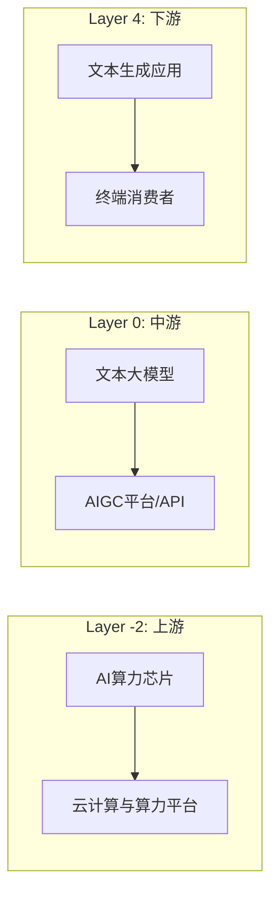

# Final Report Synthesis Guide

The main session (NOT a sub-agent) performs Phase 6 synthesis. The final report = **overall trend summary (written by the main session) + sub-agent reports concatenated VERBATIM as topic chapters (no trimming, no rewriting)**.

## Key Principles

- **Chain overview chapter**: rendered as a **mermaid diagram**, not text (see structure below)
- **Overall summary is written by the main session**: distill key findings, prosperity score, investment points and risks from the sub-agent reports; cite the source of each conclusion as "per {话题} 报告"
- **Sub-agent reports are concatenated verbatim**: each sub-agent report becomes one topic chapter of the final report — 100% preserved, no trimming, no merging, no rewriting
- **Mechanical concatenation via Bash `cat`**: never let the model re-type sub-agent content (truncation/hallucination risk)
- **Fixed chapter order**: chain overview → overall summary → nodes (by layer, upstream → downstream) → policy → competition → cross-impact → investment → historical comparison → appendix

## Report Structure

````markdown
# {行业名称} 产业趋势调研报告

**日期**: {date} | **数据截止**: {data_as_of_date} | **版本**: chain.yaml v{version}

---

## 产业链全景



**16 个产业链节点** | **39 条传导边** | **3 个支撑因素**

- 支撑因素: 政策与法规 | 资本市场 | 版权与伦理

---

## 行业趋势调研总结

### 1. 关键发现 TOP 5

| # | 发现 | 支撑数据 | 影响 |
|---|------|----------|------|
| 1 | ... | ... (per {话题} 报告) | ↑/↓/→ |
| ... | ... | ... | ... |

### 2. 综合景气度

{综合评分 X/10 + 方向 ↑/↓/→ + 置信度 高/中/低,以及锚定理由(为什么不是更高/更低)}

### 3. 投资要点与风险速览

- **投资要点**: 3-5 条关键结论(每条注明 per {话题} 报告)
- **风险 TOP 3**: 概率×影响最高的风险 + 预警信号(观测阈值)

### 4. 章节导读

- {话题A}: 一句话导读(该章回答了什么问题/最值得看什么)
- {话题B}: 一句话导读
- ...

---

## {节点A} 分析报告        ← 子代理报告原文,原样嵌入(不裁剪)
{子代理报告全文 ...}

---

## {节点B} 分析报告
{子代理报告全文 ...}

---

## 政策与监管分析报告
{子代理报告全文 ...}

---

## 竞争格局分析报告
{子代理报告全文 ...}

---

## 跨环节传导与综合研判
{子代理报告全文 ...}

---

## 投资与商业研判
{子代理报告全文 ...}

---

## 历史趋势对比

{Phase 5 内容。首次分析标注"首次分析，暂无历史对比"}

---

## 附录

### A. 数据质量
- 数据来源: {来源}
- 总数据量: {数量}
- 覆盖率: {百分比}

### B. 分析师报告索引
{从 reference.md 提取所有标题+链接}

### C. 执行统计
- Batch 1(无依赖,并行): {N} 个代理(节点 + 政策 + 竞争)
- 依赖项: 1 个 Cross-Impact Analyst(依赖全部 Batch 1 报告)、1 个 Investment Analyst(依赖 Phase 4)
- 总耗时: {时间}
````

## Chain Overview Generation (mermaid)

Generate `chain_overview.md` from chain.yaml:

1. Group nodes by `layer` ascending; one `subgraph` per layer, titled `Layer {N}: {上游/中游/下游}` (layer<0=上游, layer==0=中游, layer>0=下游)
2. One mermaid node per chain node: `{node_id}["{node_name}"]`
3. One mermaid edge per chain edge: `{from} --> {to}`
4. Below the diagram: one line of stats (node count, edge count) + a short bullet list of `supports`

## Concatenation Procedure

1. Read `reference.md` to get all sub-agent report paths
2. Order chapters: chain overview → overall summary → nodes (by layer, upstream → downstream) → policy → competition → cross-impact → investment
3. Write `chain_overview.md` (mermaid diagram, opens with `## 产业链全景`)
4. Write `analyst_reports/00_overall_summary.md` (opens with `## 行业趋势调研总结`)
5. Write `appendix.md` (data quality + report index + execution stats)
6. Concatenate with Bash into `report.md`, then `cp` to `latest_report.md` (commands in SKILL.md Phase 6)

## Quality Checklist

- [ ] Chain overview rendered as a mermaid diagram (not ASCII/text)
- [ ] Overall summary has key findings TOP 5 table (each row with supporting data + "per {话题} 报告" citation)
- [ ] Overall summary has prosperity score (score/direction/confidence/anchoring rationale)
- [ ] Overall summary has investment points (3-5) and TOP 3 risks (with trigger signals)
- [ ] Overall summary has chapter guide (one sentence per chapter)
- [ ] Every sub-agent report embedded in full, untrimmed, unrewritten (Bash `cat`, not manual re-typing)
- [ ] Chapter order: chain overview → overall → nodes (upstream→downstream) → policy → competition → cross-impact → investment → historical comparison → appendix
- [ ] Appendix contains data quality, analyst report index, execution stats
- [ ] No text walls — overall uses tables/short paragraphs; depth lives in the verbatim sub-agent chapters
